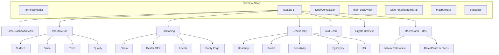
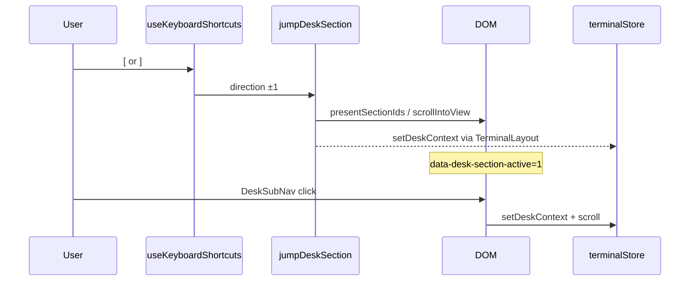
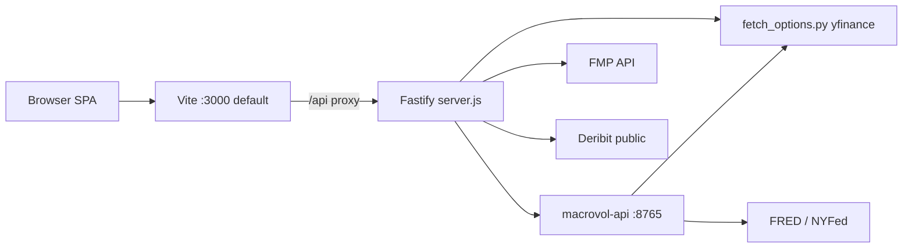
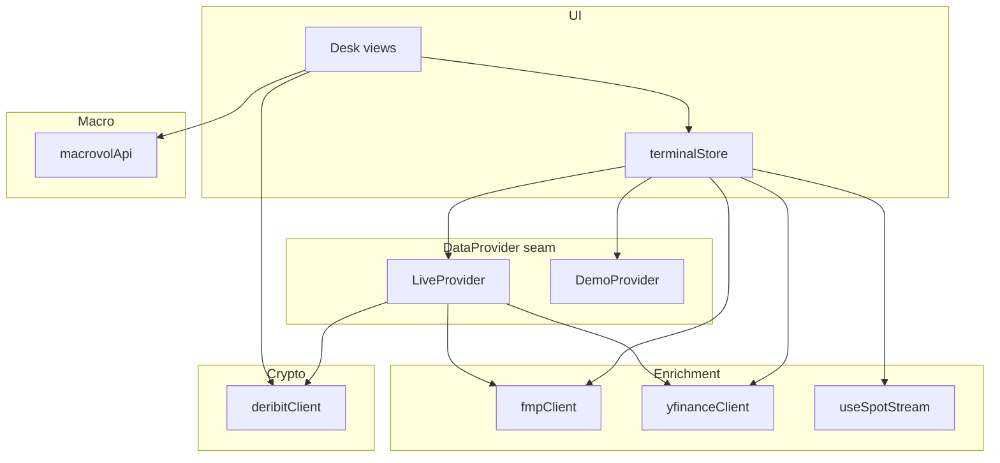
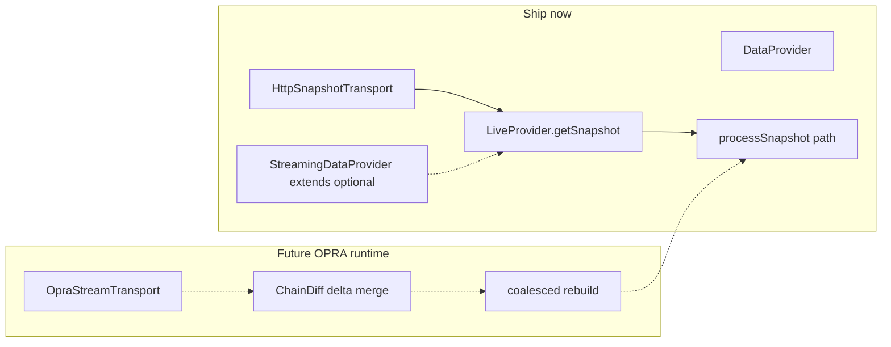
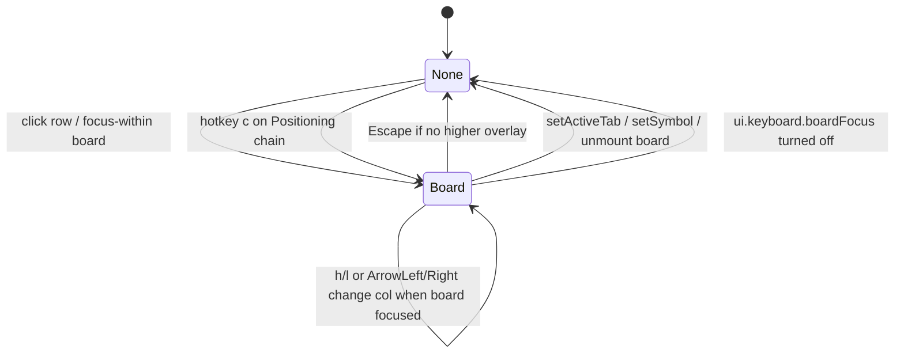
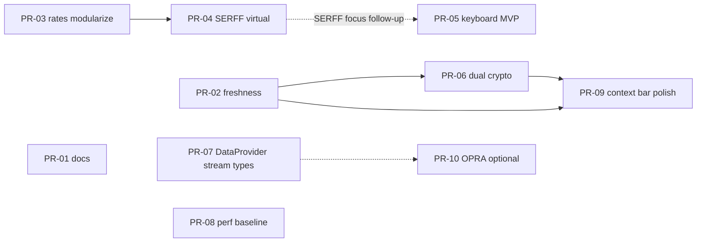

# VOLATERM — Terminal Product & Frontend Architecture Design

| Field | Value |
|-------|--------|
| **Document** | Product & Frontend Architecture |
| **Author** | _TBD_ |
| **Date** | 2026-07-09 |
| **Status** | Draft (rev 2 — review issues addressed) |
| **Workspace** | `/home/kalde/trading-terminal-pro` |
| **Related** | `UI_UX_PLAN.md` (Phases A–G shipped), `UPGRADE_PLAN.md` (accuracy/streaming), `README.md` (stale 8-tab IA) |

---

## Overview

VOLATERM is an institutional-grade options trading terminal built on React 19 / TypeScript / Vite / Zustand / Tailwind v4, with a Fastify Node proxy and a Python MacroVol service. UI/UX Phases A–G established a durable **7-desk information architecture**, density model, trust chips, desk-section navigation, and performance primitives (virtualized boards, `content-visibility`, code-split 3D).

This document **formalizes the as-built architecture** as the system of record, then designs the **next product slice**: dual crypto books, trader keyboard/focus model, Rates modularization then SERFF/calendar virtualization, coherent multi-source freshness, and an OPRA-ready evolution of the existing **`DataProvider`** seam. It ends with concrete TypeScript interfaces, performance budgets (measure-then-encode), and an ordered PR plan with an explicit dependency DAG.

---

## Background & Motivation

### Current state (as-built)

| Concern | Implementation |
|---------|----------------|
| **Shell** | `TerminalLayout` → Header / TabNav / DeskContextBar / main desk / SidePanel strip / PlaybackBar / StatusBar |
| **Desks (7)** | `TabId` / `TABS` in `tabs.ts`; `ActiveTab` in `lib/options/types.ts` (must stay in sync) |
| **Section nav** | `deskNav.ts` registries + `DeskSubNav` + `[` `]` via `jumpDeskSection` |
| **State** | Single Zustand store `terminalStore.ts` (no slices middleware); density via IIFE `localStorage` init |
| **Vol data** | `DataProvider` seam: `LiveProvider` / `DemoProvider` in `lib/data/provider.ts` |
| **Macro/rates** | MacroVol FastAPI `:8765` → Node `/api/macrovol/*` → `lib/macrovol/api.ts` |
| **Trust UI** | `Freshness` / `DataBadge` (defaults delayed 15m / stale **30m**) / `ApiSources` / StatusBar |
| **Perf** | `OptionChain` uses raw `react-window` `List`; STIR uses `VirtualRows`; SERFF/calendar are **capped non-virtual tables** (`.slice(0, 18)` / ~10–16 per pack kind); `.below-fold` CSS; lazy Greeks/Surface |

### Pain points & gaps

1. **Docs drift** — `README.md` still describes **8 tabs** and keys `1–8`, and advertises **SPY Dist** (no `SpyDistribution` view in `src/`). Code is 7 desks (`tabs.ts`).
2. **Crypto dual-book is tape-only** — `BtcView` dual columns poll Deribit index/funding/option counts every 30s; full charts/GEX/basis bind only to the **active** store symbol/snapshot. LiveProvider also fetches the active Deribit book on its own cadence → dual-book work must avoid triple fetch.
3. **`RatesPanel.tsx` is ~1.5k LOC** — owns STIR (incl. SERFF + calendar packs as sub-boards), curve, plumbing, DV01, NyFed, corr, imply drawer. Only SR3 is virtualized; SERFF/calendar are **capped** non-virtual tables (not unbounded).
4. **Keyboard incomplete for trader boards** — desks/sections/density/playback work; no **row focus**, **copy cell**, or focus lifecycle. `useKeyboardShortcuts` handles only ArrowLeft/Right (not Up/Down).
5. **Freshness is multi-vocabulary** — macro `DataBadge` (15m delayed / **30m** stale default); StatusBar `STALE_AFTER_MS` **90s** on `lastUpdate`; LiveProvider instance timestamps not first-class in store UI.
6. **OPRA / paid streaming** — `UPGRADE_PLAN.md` future; need **evolution of `DataProvider`**, not a parallel seam.
7. **Loading gate** — `independentTab` is only `rates | greeks | home`. **Crypto is blocked** by chain loading even though dual tape could render immediately.
8. **OptionChain not on `VirtualRows`** — focus/virtualization story is split until chain migrates to the shared wrapper.

### Why now

Phases A–G delivered UX primitives. Without an architecture doc, the next features risk: more mega-components, inconsistent trust labels, dual crypto that stacks Deribit load on LiveProvider, and keyboard hacks that fight Escape/playback. This design locks as-built patterns and sequences the next slice with a clear PR DAG.

---

## Goals & Non-Goals

### Goals

1. **Canonical 7-desk IA** — shell, section registries, deep-links, density, trust as durable architecture.
2. **Next product slice (specified)**
   - True dual BTC/ETH books (tape + optional charts) with explicit fetch ownership.
   - Keyboard row focus + copy-cell with full lifecycle and Escape priority.
   - Modularize Rates panel, then virtualize SERFF/calendar for consistency + keyboard.
   - Coherent multi-source freshness (all thresholds in **ms**).
   - OPRA-ready **evolution of `DataProvider`** (snapshot transport now; delta streaming later).
   - Crypto (and optional MM) independent of chain loading gate.
3. **Performance budgets** — baseline measurement first, then encode targets.
4. **Concrete TypeScript interfaces** aligned with live code (`ImplyRead`, store patterns).
5. **Incremental PR plan** with DAG and reviewable DoDs.

### Non-Goals

- Replacing Zustand with another state library or introducing slice middleware.
- Rewriting analytics math (SVI, GEX, parity) except dual-book snapshot isolation.
- Building OMS / order entry.
- **Paid OPRA production connectivity, NBBO fan-out, or ChainDiff delta-apply into SVI/arb/playback** in PRs 01–09 (interfaces + snapshot transport only; see §2.4).
- Mobile-first redesign.
- Unifying MacroVol Python into Node.
- Elevating dual-crypto book state into the global store until MM/other consumers need both books.

---

## Proposed Design

### 1. As-built durable architecture

#### 1.1 Seven-desk information architecture



| Desk | Hotkey | View | Section model |
|------|--------|------|----------------|
| Home | `1` | `DashboardView` | Deep-links via `sessionStorage desk.jump` |
| Vol Structure | `2` / `v` | `VolStructureView` | Sub-mode buttons (`vol-sub-*`) |
| Positioning | `3` | `PositioningView` | Sub-modes + strike zoom ±5/10/20% |
| Greeks | `4` | `GreeksView` (lazy) | Sub-modes; 3D code-split |
| MM Desk | `5` / `m` | `DeskView` | Blotter-first tool groups |
| Crypto | `6` / `b` | `BtcView` | Dual tape + single active book (+ proxies) |
| Macros & Rates | `7` | `RatesView` | Macro + `RATES_SECTIONS` + collapsibles |

**Tab id source of truth:**

- `TabId` + `TABS` — `src/components/terminal/tabs.ts`
- `ActiveTab` — `src/lib/options/types.ts` (comment: keep in sync with `tabs.ts`)

Migration: stale `macro` tab → `rates` in `TerminalLayout`.

**SPY Dist:** not present in `src/`. Not a top-level desk. PR-01 removes it from primary Features; optional future dashboard card only (KD12).

#### 1.2 Shell layout contract

```
┌─────────────────────────────────────────────────────────────┐
│ TerminalHeader  (symbol, source, chain mode, session)       │
├─────────────────────────────────────────────────────────────┤
│ TabNav  (7 desks)                                           │
├─────────────────────────────────────────────────────────────┤
│ DeskContextBar  (desk › section · APIs · density)           │
├─────────────────────────────────────────────────────────────┤
│ main  overflow hidden → desk owns scroll                    │
│   [DeskSubNav sticky when multi-section]                    │
│   sections with id + data-desk-section                      │
├─────────────────────────────────────────────────────────────┤
│ SidePanel  Display · Exp · spot/r/q · chain sources         │
├─────────────────────────────────────────────────────────────┤
│ PlaybackBar                                                 │
│ StatusBar  LIVE/STALE · session · SSE · provenance · dens.  │
└─────────────────────────────────────────────────────────────┘
```

**Density:** `uiDensity: 'dense' | 'readable'` on store + `localStorage ui.density` (IIF init in store); root classes `density-dense` / `density-readable`. Toggle: **`D`**.

**Trust primitives:**

| Primitive | Path | Role |
|-----------|------|------|
| `classifyFreshness` / chips | `components/common/Freshness.tsx` | LIVE / DELAYED / STALE / EXPIRED / DEMO / DOWN |
| `DataBadge` | `components/macrovol/DataBadge.tsx` | as_of + source; defaults delayed **15m**, stale **30m** |
| `ApiSources` | `components/macrovol/ApiSources.tsx` | Section-level upstream chips |
| StatusBar | `components/terminal/StatusBar.tsx` | Global LIVE/STALE (`STALE_AFTER_MS` 90s) + chain/spot labels |
| `EmptyState` / skeletons | `components/common/EmptyState.tsx` | Empty / loading sections |
| `SectionErrorBoundary` | `components/common/SectionErrorBoundary.tsx` | Isolate section crashes |

#### 1.3 Desk navigation model



- **Registries:** `RATES_SECTIONS`, `VOL_SECTIONS`, `GREEKS_SECTIONS`, `POSITIONING_SECTIONS` in `src/config/deskNav.ts`.
- **Sub-mode desks** (vol/greeks/positioning): section ids are **button** ids; jump calls `.click()`.
- **Scroll desks** (rates): section ids are **DOM section** ids; IntersectionObserver in `DeskSubNav`.
- **Home deep-link:** `sessionStorage.desk.jump = sectionId`, `setActiveTab('rates')`; `RatesView` consumes on mount.
- **`setActiveTab`:** already clears `deskSectionId` / label / apis — board focus must clear too (see §3 P2).

#### 1.4 Shared interaction primitives

| Primitive | Path | Usage today |
|-----------|------|-------------|
| `CollapsibleSection` + `usePersistedBool` | `terminal/CollapsibleSection.tsx`, `hooks/usePersistedBool.ts` | Rates sections; `.below-fold` |
| `VirtualRows` | `common/VirtualRows.tsx` | STIR SR3 only (overscanCount default 6) |
| `StickyTable` | `common/StickyTable.tsx` | Rates boards |
| `ImplyDrawer` / `ImplyChip` | `common/ImplyDrawer.tsx` | STIR / curve imply; Esc closes drawer |
| `ExportCsvButton` | `common/ExportCsvButton.tsx` | Chain, STIR |
| `Panel` | `terminal/Panel.tsx` | Card chrome |
| `Explain` | `common/Explain.tsx` | Glossary hovers |
| `ShortcutsOverlay` | `terminal/ShortcutsOverlay.tsx` | Esc / `?` closes |

#### 1.5 Runtime topology



| Process | Default | Env |
|---------|---------|-----|
| Vite | `VITE_PORT` or 3000 | proxies `/api` → `API_TARGET` or `:3001` |
| Fastify | `PORT` or 3001 | CORS includes 3200/3201; **global rate-limit `max: 600` / 1 min** |
| MacroVol | 8765 | `MACROVOL_API_URL` |

Note: `API_CONFIG.rateLimit.MAX_REQUESTS: 30` in `constants.ts` is **not** what `server.js` enforces (600/min). Dual-crypto capacity is bounded by **Deribit public rate + client cache TTL (~15s bundle)** and FMP/MacroVol upstreams—not the Fastify 600/min ceiling.

Dev: `npm run dev` = concurrently web + api + macrovol-api.

---

### 2. Data architecture & trust model

#### 2.1 Layers today



**Vol path (`LiveProvider.getSnapshot`):**

1. BTC/ETH + auto/deribit → Deribit market bundle → `buildDeribitSnapshot(..., { maxExpiries: 12 })`.
2. Else spot: FMP quote → yfinance history.
3. Equity chain: yfinance (auto) → FMP options (paid).
4. Fallback: synthetic SVI at best-known spot; `surfaceSource: 'synthetic'`.

**Provenance fields on store today:** `spotSource`, `chainUsed`, `chainAvailable`, `historySource`, `profileSource`, `fundingAnn`, `lastSpotUpdate`, `lastChainUpdate`, `streamConnected`, `historyMode`.

**Refresh cadences (`REFRESH_CONFIG`):**

| Mode | Interval |
|------|----------|
| Demo poll | 3s |
| Live orchestrator | 10s |
| Spot open / closed | 12s / 120s |
| Chain open / closed | 45s / 300s |
| StatusBar stale | 90s after `lastUpdate` |
| Crypto dual tape | 30s (local in `BtcView`) |
| Deribit market bundle cache | ~15s (`deribitClient`) |

#### 2.2 Unified freshness model (target)

Single vocabulary; **all thresholds in milliseconds** (one type, no unit branching).

```ts
/** Canonical freshness domains — do not mix thresholds across domains. */
export type FreshnessDomain =
  | 'spot'
  | 'chain'
  | 'macro'
  | 'crypto'
  | 'stream';

export type FreshnessKind =
  | 'live' | 'delayed' | 'stale' | 'expired' | 'demo' | 'down' | 'unknown';

export interface FreshnessThresholds {
  delayedMs: number;
  staleMs: number;
  expiredMs: number;
}

/** Domain-specific defaults (milliseconds). Macro aligned with live DataBadge. */
export const FRESHNESS_THRESHOLDS: Record<FreshnessDomain, FreshnessThresholds> = {
  // Spot: open poll 12s + SSE; allow hitch before DELAYED (not 15s hair-trigger)
  spot:   { delayedMs: 45_000,  staleMs: 90_000,   expiredMs: 600_000 },
  // Chain: open poll 45s
  chain:  { delayedMs: 60_000,  staleMs: 180_000,  expiredMs: 900_000 },
  // Crypto tape/books: 30s poll + 15s cache — delayed > poll to reduce edge flicker
  crypto: { delayedMs: 45_000,  staleMs: 120_000,  expiredMs: 600_000 },
  // Macro: match DataBadge defaults (15m delayed / 30m stale)
  macro:  { delayedMs: 900_000, staleMs: 1_800_000, expiredMs: 14_400_000 },
  stream: { delayedMs: 5_000,   staleMs: 30_000,   expiredMs: 120_000 },
};

export interface DataProvenance {
  domain: FreshnessDomain;
  source: string;
  asOfMs: number | null;
  fetchedAtMs: number;
  kind: FreshnessKind;
  label?: string;
}

/**
 * Classify with optional hysteresis when leaving LIVE:
 * stay LIVE until age > delayedMs * leaveLiveFactor (default 1.2).
 */
export function classifyDomainFreshness(
  asOfMs: number | null | undefined,
  domain: FreshnessDomain,
  opts?: { demo?: boolean; down?: boolean; previousKind?: FreshnessKind; leaveLiveFactor?: number },
): FreshnessKind;
```

**Compatibility:** Keep `classifyFreshness(asOf: string, { delayedMin, staleMin })` as a thin wrapper for macro ISO strings (default delayedMin=15, staleMin=**30** to match `DataBadge`, not the old 60).

**Mapping rules:**

| Surface | Domain | LIVE if | DEMO if | DOWN if |
|---------|--------|---------|---------|---------|
| StatusBar spot | `spot` | age &lt; delayed (+ hysteresis) and not demo | `source=demo` | hard-fail + no last value |
| StatusBar chain | `chain` | real chain + age &lt; delayed | `chainUsed=synthetic` or surface synthetic | N/A (synth fallback) |
| Macro `DataBadge` | `macro` | as_of within delayedMs | — | macrovol health down |
| Crypto dual tape | `crypto` | Deribit ok + age | — | fetch null |
| SSE badge | `stream` | `streamConnected` | — | disconnect |

**Store contract (required shape, nulls allowed):**

```ts
// Always present on TerminalStore — not optional fields
provenance: {
  spot: DataProvenance | null;
  chain: DataProvenance | null;
  cryptoBtc: DataProvenance | null;
  cryptoEth: DataProvenance | null;
  macro: DataProvenance | null; // set when Rates/Home last loaded summary
};
```

Updated in `fetchLiveSnapshot`, enrichment, dual-books hook, and macro loaders. StatusBar dual chips consume **only** `provenance.spot` / `provenance.chain`.

#### 2.3 Offline / demo fallback

```
source=demo  → DemoProvider only; chips DEMO
source=live  → attempt real; chain fail → synthetic surface + one-shot toast (liveWarned)
             → spot fail → synthetic spot + spotSource synthetic
macrovol down → Rates EmptyState / DataBadge down; Home macro strip degraded
Deribit down → dual tape DOWN; active book last snapshot or synth
Vercel       → no yfinance chain; enrichment + synthetic surface
```

Never show pure LIVE for chain without `chainAvailable && surfaceSource === 'live'`.

#### 2.4 OPRA — ship now vs future

**Ship now (PRs 01–09):** evolve the existing **`DataProvider`** seam; optional transport helpers; **snapshot-only**.

**Future (non-goals for this slice / optional PR-10):** paid OPRA vendor, server WS fan-out, NBBO, `ChainDiff` delta merge, 250–500ms surface rebuild coalescing, ring-buffer interaction for partial books.



**Evolution (not a parallel fork):**

```ts
// src/lib/data/provider.ts — evolve in place
export interface DataProvider {
  readonly id: Source;
  getSnapshot(symbol: string, ctx?: SnapshotContext): Promise<VolSnapshot | null>;
  getHistory?(symbol: string, frames?: number): HistoricalFrame[];
}

/** Optional capability — LiveProvider may implement later; Demo never streams. */
export interface StreamingDataProvider extends DataProvider {
  readonly supportsStreaming: boolean;
  connect?(symbol: string): Promise<void>;
  disconnect?(): void;
  onQuote?(cb: (t: QuoteTick) => void): () => void;
  /** Snapshot-only for this horizon; delta mode is future. */
  onChainSnapshot?(cb: (snap: VolSnapshot) => void): () => void;
}

export interface QuoteTick {
  symbol: string;
  bid: number | null;
  ask: number | null;
  last: number | null;
  size?: number;
  ts: number;
  source: 'opra' | 'yfinance' | 'fmp' | 'deribit' | 'synthetic';
}

/** Future only — do not implement delta-apply in this slice. */
export interface ChainDiff {
  symbol: string;
  mode: 'snapshot' | 'delta'; // ship adapters with mode: 'snapshot' only
  // ... contract rows ...
  asOfMs: number;
}
```

**Store apply path (snapshot):** existing `fetchLiveSnapshot` → `processSnapshot` → `storeFrames` / `pushLiveFrame`. Optional helper name: `applyChainSnapshot(snap)` = that pipeline. No delta merge algorithm in this slice.

**Transport:** thin `HttpSnapshotTransport` may wrap HTTP fetches used by LiveProvider; **`getProvider()` remains the store’s only entry**. Acceptance: all existing call sites still use `getProvider()`; one adapter unit test proves LiveProvider still serves snapshots.

**PR-10:** optional vendor skeleton only after Open Question 3 (vendor) is decided; not required for “implementation ready.”

---

### 3. Next product slice (detailed)

Prioritized by trader value × architectural leverage.

#### P0 — Docs & IA truth

- Align `README.md` with 7 desks, keys `1–7`, `[` `]` `D`, MacroVol, Deribit.
- **Remove SPY Dist from primary Features** (not in codebase). Optional: “historical return dist may return as Home card later.”
- Point architecture section at this doc.

#### P1 — Dual crypto books (not tape-only)

**Ownership model (authoritative):**

| Concern | Decision |
|---------|----------|
| Book state location | **Hook-local** (`useCryptoDualBooks`) — not on `terminalStore` until MM needs both |
| Market fetch | Always go through `fetchDeribitMarket` (shared ~15s cache) |
| Snapshot build | `buildDeribitSnapshot(market, { maxExpiries })` **directly** — not a second LiveProvider instance |
| Active book vs store | Selecting tape column → `setSymbol(ccy)` → existing LiveProvider refresh owns **authoritative** `snapshot` for SidePanel/MM/Greeks |
| Dual-books hook role | Maintains **both** lightweight derived views for tape + optional dual charts; **does not** double-apply active book into store every tick |
| Triple-fetch avoidance | Tape metadata + dual-books + LiveProvider all hit **same cache key**; inactive book poll at **half rate** (KD11); active book structure charts may read store `snapshot` when symbol matches to skip rebuild |
| Proxies IBIT/BITO/MSTR | Dual tape remains BTC\|ETH only; proxy selection keeps **single-book equity path** (LiveProvider yfinance/FMP); no dual-book entry for proxies |
| Dual charts flag | `ui.crypto.dualCharts` via store IIFE/`usePersistedBool`, default **false** |

```ts
// hooks/useCryptoDualBooks.ts
export type CryptoBookState = {
  ccy: 'BTC' | 'ETH';
  market: DeribitMarketBundle | null;
  /** Thin snapshot for dual-pane charts; null if dualCharts off and not active */
  snapshot: VolSnapshot | null;
  asOf: number;
  status: 'ok' | 'down' | 'loading';
};

export function useCryptoDualBooks(opts?: {
  intervalMs?: number;          // default 30_000 active
  inactiveIntervalMs?: number;  // default 60_000 (half-rate)
  dualCharts?: boolean;
  active: 'BTC' | 'ETH';
}): { btc: CryptoBookState; eth: CryptoBookState };
```

**UI:**

```
┌──────────── Dual tape (always) ───────────┐
│ BTC LIVE …        │ ETH LIVE …            │
└───────────────────────────────────────────┘
  [ proxy chips: BTC ETH IBIT BITO MSTR ]   ← single-book when proxy

Optional dual-pane (flag on):
┌─ BTC thin charts ──┬─ ETH thin charts ──┐
│ term · funding     │ term · funding     │
│ GEX spark          │ GEX spark          │
└────────────────────┴────────────────────┘
```

**maxExpiries:** inactive dual-chart book **6–8**; active store path remains LiveProvider **12**. Wire via existing `buildDeribitSnapshot` options (`src/lib/options/deribit.ts`).

**Loading gate:** include `crypto` in `independentTab` so dual tape shell paints while equity chain still loads (PR-06). Optionally `desk` too.

#### P2 — Keyboard row focus + copy-cell

##### Focus lifecycle



1. **Acquire:** (a) click on a focusable row; (b) focus-within + first row if board registered `autoFocusOnEnter`; (c) hotkey `c` on Positioning focuses `chain` board at ATM/current row. No automatic multi-board focus on Rates until user clicks STIR/SERFF.
2. **Arbitration:** only one `boardId` at a time (store SoT). Clicking another board steals focus.
3. **Clear:** `setActiveTab`, `setSymbol`, board unmount, Escape (see priority), or flag off.
4. **Registry:** `Map<BoardFocusId, FocusableBoardApi>` — **imperative only** (`scrollToRow`, `getCellText`, `rowCount`, `colKeys`). Register/unregister in `useEffect` cleanup (Strict Mode safe). **Not** a second React state copy.
5. **Store SoT:** `boardFocus: BoardFocusState` on Zustand only; components select it for ring styles.

##### Escape priority stack

| Priority | Consumer | Behavior |
|----------|----------|----------|
| 1 (highest) | `ShortcutsOverlay` open | close overlay |
| 2 | `ImplyDrawer` open | close drawer |
| 3 | `boardFocus.boardId != null` | clear board focus |
| 4 | default | no-op |

Implement a single Escape coordinator in `TerminalLayout` (or keyboard hook) that checks overlay → imply → boardFocus. Local listeners on ImplyDrawer/ShortcutsOverlay must either defer to coordinator or run only when they are the top layer (document which wins; prefer **coordinator**).

##### Key bindings when board focused

| Key | Action |
|-----|--------|
| `j` / `ArrowDown` | row +1 (`preventDefault`) |
| `k` / `ArrowUp` | row −1 |
| `h` / `ArrowLeft` | prev column (**playback scrub disabled** while board focused) |
| `l` / `ArrowRight` | next column (**note:** letter `L` remains Live toggle; only ArrowRight for cols if `l` conflicts — prefer arrows for cols, `j`/`k` for rows) |
| `y` or Ctrl/Cmd+C | copy focused cell text |
| `Escape` | clear board focus (if top of stack) |
| `c` | focus option chain when on Positioning |

##### Hook extension

```ts
// useKeyboardShortcuts — add:
// ArrowUp / ArrowDown
// When boardFocus.boardId != null: route arrows + j/k/y to board actions; skip playback arrows
// Guards: INPUT/TEXTAREA/SELECT (existing); also contentEditable and [role=dialog] when not our imply
```

##### Feature flag

- `ui.keyboard.boardFocus` — default **true** (or on); read like density IIFE / `usePersistedBool`.
- Rollback: set false → no acquire, clear existing focus, restore full playback arrows.

##### a11y

- Virtual lists: `role="grid"` or listbox pattern; focused row `aria-selected` / `aria-activedescendant` on the list container.
- `getRowA11yLabel` on board API for screen readers.
- Roving `tabIndex={0}` only on focused row proxy if using grid.

##### Scope

- **PR-05 MVP:** OptionChain (after migrate to `VirtualRows`) + STIR SR3.
- **Follow-up (after PR-04 virtualize):** SERFF + calendar boards register same API.

#### P3 — Modularize RatesPanel (**before** SERFF virtualization)

**Problem:** 1584-line monolith blocks reviewable virtualization and tests.

**Target structure (1:1 with section ids):**

```
src/components/macrovol/
  RatesPanel.tsx                 # orchestrator: useRatesData, imply drawer state, composition only
  MacroPanel.tsx                 # unchanged; mounted from RatesView (sec-macro)
  rates/
    useRatesData.ts              # Promise.allSettled batch + types
    RatesSnapshotSection.tsx     # sec-snapshot
    CurveShapeSection.tsx        # sec-shape
    Dv01Section.tsx              # sec-dv01
    NyFedSection.tsx             # sec-nyfed
    StirPathSection.tsx          # sec-stir — OWNS:
    #   - SR3 VirtualRows + CSV + imply chips
    #   - SerffBoard (sub-board, not a desk section id)
    #   - CalendarPacksBoard (sub-board)
    #   - path cut/hike table if present
    SerffBoard.tsx               # used only inside StirPathSection
    CalendarPacksBoard.tsx       # used only inside StirPathSection
    BasisSection.tsx             # sec-basis
    PlumbingSection.tsx          # sec-plumbing
    CurveSection.tsx             # sec-curve (UST)
    CorrSection.tsx              # sec-corr
    PremiumMapSection.tsx        # sec-premium
    CarrySection.tsx             # sec-carry
```

**Outside RatesPanel (stay in `RatesView.tsx`):**

| Id | Component | storageKey |
|----|-----------|------------|
| `sec-macro` | `MacroPanel` | (panel-internal if any) |
| `sec-asset-corr` | collapsible in RatesView | `rates.sec.asset-corr` |

**Stable storageKeys (must not rename):**

`rates.sec.snapshot`, `rates.sec.shape`, `rates.sec.dv01`, `rates.sec.nyfed`, `rates.sec.stir`, `rates.sec.basis`, `rates.sec.plumbing`, `rates.sec.curve`, `rates.sec.corr`, `rates.sec.premium`, `rates.sec.carry`, `rates.sec.asset-corr`.

**Constraints:**

- Preserve all `RATES_SECTIONS` ids for `[` `]` / IntersectionObserver.
- One parallel fetch batch in `useRatesData` (no N waterfalls).
- Each section: `SectionErrorBoundary`.
- **Gate:** Rates visual checklist from `UI_UX_PLAN.md` (STIR scroll/CSV/imply, section jump).

#### P4 — Virtualize SERFF / calendar (after modularize)

**Reality check:** SERFF is already `.slice(0, 18)`; calendar packs ~10–16 per kind — **not** unbounded DOM. ROI is lower than pre-virtual SR3 but still valuable for: (1) uniform board primitive, (2) keyboard row focus, (3) future uncapped feeds.

**Approach:**

1. Inside extracted `SerffBoard` / `CalendarPacksBoard`, use `VirtualRows` (`rowHeight: 28`, height `min(40vh, 320px)`, overscan 6).
2. Sticky header outside List.
3. CSV for SERFF; register focus APIs.
4. Optionally same pass: path cut/hike table if still non-virtual.

**Target:** ≤ ~25–30 DOM row nodes; consistent with STIR.

#### P5 — Coherent freshness wiring

- Implement §2.2; StatusBar dual chips from required `provenance`.
- Crypto tape uses domain `crypto`.
- Macro keeps DataBadge-compatible thresholds (15m/30m).

#### P6 — DataProvider streaming capability (OPRA-ready)

- Optional `StreamingDataProvider` methods; Http transport if needed.
- Zero UX change; `getProvider()` unchanged for store.

---

### 4. Performance budget

| Surface | Metric | Target | Notes |
|---------|--------|--------|-------|
| Option chain | DOM rows | ≤ 40 (+ **overscan 6–8**) | After VirtualRows migration |
| Option chain | Build rows `useMemo` | &lt; 8ms / 200 strikes | **Measure first** |
| STIR / SERFF | DOM rows | ≤ 30 | SERFF already capped ≤18 data rows |
| Desk switch (non-lazy) | Interactive paint | &lt; 100ms | **Baseline in PR-08** |
| Desk switch → Greeks | Chunk + paint | &lt; 400ms warm | |
| 3D surface | Mount after geometry | &lt; 500ms | |
| 3D orbit | fps @ 1080p | ≥ 30 | |
| Dual crypto tape | Network | shared cache; inactive half-rate | Not “2 free fetches” |
| Dual crypto charts on | Recharts | max 2 thin books | Excluded from 16ms store tick budget |
| Rates load | `allSettled` wall | &lt; 2.5s p95 local | Baseline first |
| Store tick (spot-only patch) | Main thread | &lt; 16ms | Dual-chart rebuilds **out of scope** for this budget |

**PR-08 process:** (1) add DEV `performance.mark/measure` for desk switch, Rates load, Deribit bundle; (2) record baseline in PR description; (3) encode `src/config/perfBudget.ts` with measured + aspirational labels.

**Hotspots:** Greeks heatmap; DeskView tool switch; Rates below-fold `content-visibility`.

---

## API / Interface Changes

### Desk sections

```ts
export type DeskNavItem = {
  id: string;
  label: string;
  short?: string;
  apis?: string[];
  kind?: 'scroll' | 'mode';
};
```

### Imply (canonical — match `src/lib/macrovol/api.ts`)

```ts
export interface ImplyRead {
  bias: string;       // required in MacroVol payloads
  label: string;
  text: string;
  confidence?: string;
}
```

Drawer still defaults missing bias to `'neutral'` at render for resilience; do not re-optionalize the type.

### Virtual boards + focus

```ts
export type BoardFocusId = 'chain' | 'stir-sr3' | 'serff' | 'calendar' | 'dealer-bars';

export interface BoardFocusState {
  boardId: BoardFocusId | null;
  rowIndex: number;
  colKey: string | null;
}

/** Imperative registry only — not React state */
export interface FocusableBoardApi {
  rowCount: number;
  colKeys: string[];
  getCellText: (row: number, col: string) => string;
  scrollToRow?: (row: number) => void;
  getRowA11yLabel?: (row: number) => string;
}

export type VirtualRowsProps<T> = {
  items: T[];
  rowHeight?: number;
  height?: number;
  className?: string;
  renderRow: VirtualRowRender<T>;
  overscanCount?: number; // default 6
  boardId?: BoardFocusId;
  focusedIndex?: number;
  onRowClick?: (index: number) => void;
  getRowA11yLabel?: (item: T, index: number) => string;
};
```

**OptionChain:** migrate to `VirtualRows` (prefer over dual List focus paths) so KD5 holds.

### Crypto dual books

See §3 P1 `useCryptoDualBooks` — hook-local only.

### DataProvider evolution

See §2.4 — no separate `MarketDataFeed` as store entry point.

---

## Data Model Changes

### Store additions

```ts
// TerminalStore — single interface, inline actions (no slices)

// Required shape (nulls OK)
provenance: {
  spot: DataProvenance | null;
  chain: DataProvenance | null;
  cryptoBtc: DataProvenance | null;
  cryptoEth: DataProvenance | null;
  macro: DataProvenance | null;
};

boardFocus: BoardFocusState; // { boardId: null, rowIndex: 0, colKey: null }

// Persisted like density (IIF localStorage init + setter writes key)
cryptoDualCharts: boolean;           // key: ui.crypto.dualCharts, default false
keyboardBoardFocusEnabled: boolean;  // key: ui.keyboard.boardFocus, default true

// Do NOT add cryptoBooks to store in this slice
```

**Persistence pattern (match density):**

```ts
cryptoDualCharts: (() => {
  try {
    return localStorage.getItem('ui.crypto.dualCharts') === '1';
  } catch { return false; }
})(),
setCryptoDualCharts: (on: boolean) => {
  try { localStorage.setItem('ui.crypto.dualCharts', on ? '1' : '0'); } catch { /* */ }
  set({ cryptoDualCharts: on });
},
```

Same for `ui.keyboard.boardFocus` (`'0'` to disable).

### Snapshot isolation

`VolSnapshot` unchanged. Inactive dual-chart books use thinner `maxExpiries`. No BTC/ETH merge.

### No DB migrations

---

## Alternatives Considered

### A. Keep single active crypto book only (status quo tape)

| Pros | Cons |
|------|------|
| Minimal code | Cannot compare BTC vs ETH structure without symbol switch |

**Decision:** Reject as end-state; tape always dual; charts optional.

### B. Split Rates into micro-apps / iframes

**Decision:** Reject — breaks nav, density, imply, theme.

### C. Global event bus for keyboard

**Decision:** Reject — store `boardFocus` + imperative registry is clearer.

### D. GraphQL BFF

**Decision:** Reject for this horizon.

### E. `@tanstack/react-virtual` instead of react-window v2

**Decision:** Reject — standardize on react-window via `VirtualRows`.

### F. Evolve `DataProvider` vs new `MarketDataFeed` fork

| Pros of evolve | Cons of fork |
|----------------|--------------|
| Single seam already documented in provider.ts | Two getSnapshot APIs; migration ambiguity |
| Store keeps `getProvider()` | Dead abstraction risk |

**Decision:** **Evolve `DataProvider` / optional `StreamingDataProvider`**. Do not introduce a parallel store-facing feed interface. Thin HTTP transport helpers OK.

### G. Keep SERFF/calendar as capped tables only (no virtualize)

| Pros | Cons |
|------|------|
| Less work; already ≤18 rows | Inconsistent with STIR; keyboard focus harder; future feed growth |

**Decision:** Still virtualize **after** modularize for uniformity + keyboard, with ROI honesty (not a firefight).

---

## Security & Privacy Considerations

| Risk | Severity | Mitigation |
|------|----------|------------|
| API keys in browser | High | Keys server-side; SPA same-origin `/api/*` |
| OPRA redistribution | Critical | Future only; never unauthenticated browser→OPRA |
| SSRF via proxies | Medium | Allowlists in `api/_shared.js` / macrovol proxy |
| Clipboard copy | Low | User-initiated only |
| localStorage prefs | Low | UI prefs only |
| Rate limits | Medium | Fastify **global 600 req/min** (`server.js`); real dual-crypto constraint = Deribit public + **~15s client cache** + FMP/MacroVol quotas — not 30/min |
| XSS from news | Medium | Text only; no unsanitized HTML |

**Auth:** no user auth today; OPRA later needs server entitlement.

---

## Observability

| Signal | How |
|--------|-----|
| Live fetch fail | toast + console |
| Synthetic fallback | one-shot toast |
| Macro down | DataBadge / EmptyState |
| Perf | DEV marks (PR-08); baselines in PR notes |
| Provenance | StatusBar + context bar |

Server: Fastify logs; macrovol 502 hints; FMP proxy errors. Future: extend `/api/health` probes.

---

## Rollout Plan

| Stage | Flag / gate | Notes |
|-------|-------------|-------|
| 1 Docs IA | none | includes SPY Dist removal from Features |
| 2 Freshness + light context provenance | none | PR-02 |
| 3 Rates modularize | visual checklist | PR-03 |
| 4 Virtual SERFF/calendar | none | PR-04 after 3 |
| 5 Board keyboard | `ui.keyboard.boardFocus` default on | PR-05 MVP: chain + STIR |
| 6 Dual crypto | `ui.crypto.dualCharts` default off; crypto independent tab | PR-06 |
| 7 Streaming capability types | zero UX | PR-07 |
| 8 Perf baseline + budgets | DEV only | PR-08 |
| 9 Context bar polish | non-overlap with PR-02 | PR-09 optional thin |
| OPRA later | vendor + `OPRA_ENABLED` | PR-10 optional |

**Rollback:** dual charts flag; keyboard flag; pure refactors revert by PR.

**Testing gates:** `npm run type-check`, `npm test`; Rates checklist; optional Playwright smoke if cheap (playwright already in devDependencies) — not required for every PR.

---

## Key Decisions

| # | Decision | Rationale |
|---|----------|-----------|
| 1 | **7-desk IA is canonical**; README 8-tab list obsolete | Code shipped; docs follow |
| 2 | **Dual crypto book state stays hook-local**; store keeps authoritative active `snapshot` via `setSymbol` + LiveProvider | Avoid store explosion; MM does not need both books yet |
| 3 | **Dual crypto charts default off** (`ui.crypto.dualCharts`) | Recharts cost control |
| 4 | **All freshness thresholds in ms**; macro 15m/30m (DataBadge); spot delayed 45s / stale 90s; **hysteresis 1.2×** leave LIVE; **provenance required shape** | Fix unit footgun + StatusBar/DataBadge alignment |
| 5 | **react-window v2 via `VirtualRows`**; migrate OptionChain onto it | One virtualization + focus path |
| 6 | **Store holds `BoardFocusState`; registry holds imperative APIs only** | Single write path; Strict Mode safe register/unregister |
| 7 | **Modularize RatesPanel before SERFF virtualize** | One DOM pass; testable boards; KD aligned with PR order |
| 8 | **Evolve `DataProvider` (+ optional streaming methods); snapshot-only this slice** | Existing seam; no fork; delta/OPRA runtime later |
| 9 | **Greeks/Surface stay code-split** | Bundle lean |
| 10 | **No OMS** | Analytics terminal scope |
| 11 | **Inactive crypto market refresh at half-rate** (e.g. 60s vs 30s) | Cut Deribit load; cache already 15s |
| 12 | **SPY Dist is not a top-level desk**; remove from README primary Features | No implementation in `src/` |
| 13 | **Escape priority: ShortcutsOverlay → ImplyDrawer → boardFocus** | Avoid fighting existing Esc handlers |
| 14 | **Crypto is an independent loading tab** (tape shell without waiting on equity chain) | Desk 6 usable during SPY load |
| 15 | **`ui.keyboard.boardFocus` flag** default on for rollback | Matches rollout claims |

---

## Open Questions

1. ~~Default dual crypto charts?~~ → **KD3: off**
2. ~~Half-rate inactive book?~~ → **KD11: yes**
3. **OPRA vendor** (Polygon vs CBOE LiveVol vs other)? — commercial; blocks only optional PR-10.
4. Persist board focus column prefs? — **no in v1**.
5. Merge MM Desk tools into deskNav for `[` `]`? — **nice-to-have; not blocking**.
6. ~~SPY Dist fate?~~ → **KD12: remove from primary Features**

---

## Risks

| Risk | Severity | Mitigation |
|------|----------|------------|
| Dual full chains OOM / jank | Medium | Thin inactive maxExpiries; flag dual charts; half-rate |
| Triple Deribit fetch stack | Medium | Shared cache; hook builds snapshots; LiveProvider owns active store path only |
| Escape / keyboard conflicts | Medium | Priority stack KD13; board-focus flag; tests |
| Rates refactor visual regressions | Medium | PR-03 visual checklist; frozen ids/storageKeys |
| Freshness chip flicker | Low | delayed &gt; poll; hysteresis 1.2× |
| Feed abstraction leak | Medium | Evolve DataProvider; getProvider facade |
| SERFF virtualize low ROI | Low | Honest caps; still for keyboard uniformity |
| Dead StreamingDataProvider types | Low | PR-07 acceptance: getProvider + one test only |

---

## References

| Resource | Path / note |
|----------|-------------|
| UI/UX plan (A–G) | `UI_UX_PLAN.md` |
| Accuracy/streaming | `UPGRADE_PLAN.md` |
| Desk nav | `src/config/deskNav.ts` |
| Tabs / TabId | `src/components/terminal/tabs.ts` |
| ActiveTab | `src/lib/options/types.ts` |
| Store | `src/store/terminalStore.ts` |
| DataProvider | `src/lib/data/provider.ts` |
| MacroVol client | `src/lib/macrovol/api.ts` |
| Freshness / DataBadge | `Freshness.tsx`, `DataBadge.tsx` |
| Shell | `TerminalLayout.tsx` |
| Rates | `RatesPanel.tsx` (~1584), `RatesView.tsx` (macro + asset-corr) |
| Crypto | `BtcView.tsx` |
| Chain | `OptionChain.tsx` (raw List today) |
| Deribit | `deribitClient.ts` (~15s cache), `options/deribit.ts` (`maxExpiries`) |
| Server rate limit | `server.js` `max: 600` / 1 minute |

---

## PR Plan

### Dependency DAG



**Parallelizable:** PR-01, PR-02, PR-07, PR-08 (no mutual deps).  
**Sequential spine:** PR-03 → PR-04; PR-05 MVP can start after OptionChain VirtualRows (with PR-03/04 for SERFF later).  
**PR-06** soft-deps PR-02 for crypto provenance.

---

### PR-01 — Align product docs with 7-desk IA

- **Title:** `docs: align README with 7-desk IA and current shortcuts`
- **Files:** `README.md` (+ optional link to this design)
- **Dependencies:** none
- **Description:** Replace 8-tab list and keys 1–8; document `[` `]` `D`; MacroVol; Deribit; density. **Remove SPY Dist from primary Features** (KD12). Architecture tree matches `common/`, `macrovol/`, `config/`.

### PR-02 — Unified freshness (ms) + required provenance + StatusBar dual chips

- **Title:** `feat(trust): domain freshness in ms and store provenance`
- **Files:** `src/lib/data/freshness.ts`, `Freshness.tsx`, `DataBadge.tsx` (align stale default 30m), `StatusBar.tsx`, `terminalStore.ts` (`provenance` required), tests
- **Dependencies:** none (parallel with PR-01)
- **Description:** `FRESHNESS_THRESHOLDS` all ms; hysteresis; map spot/chain ages; synthetic never pure LIVE for chain. Optional light DeskContextBar chain kind if zero-conflict with PR-09 — prefer StatusBar only here.
- **DoD:** StatusBar shows spot + chain kinds from `provenance`; DataBadge defaults unchanged visually for macro.

### PR-03 — Modularize RatesPanel (**before** virtualize)

- **Title:** `refactor(rates): split RatesPanel into section modules`
- **Files:** `src/components/macrovol/rates/*`, slim `RatesPanel.tsx`, `RatesView.tsx` unchanged ownership of macro/asset-corr, `deskNav.ts` ids frozen
- **Dependencies:** none
- **Description:** Pure refactor. Extract `useRatesData`, all sections including NyFed/Corr; STIR section owns SerffBoard + CalendarPacksBoard subcomponents (still non-virtual OK). Frozen storageKeys.
- **DoD / gate:** UI_UX_PLAN Rates verify steps (STIR virtualized scroll, CSV, imply chip, `[` `]` jump, collapsibles). Visual parity checklist in PR description.

### PR-04 — Virtualize SERFF and calendar boards

- **Title:** `perf(rates): virtualize SERFF and calendar boards`
- **Files:** `rates/SerffBoard.tsx`, `rates/CalendarPacksBoard.tsx`, `VirtualRows.tsx`, tests
- **Dependencies:** **PR-03**
- **Description:** VirtualRows + sticky headers + CSV; note existing caps. Optional path table. Register boards for later keyboard.
- **DoD:** ≤30 DOM rows; section jump intact.

### PR-05 — Board keyboard focus + copy-cell (MVP: chain + STIR)

- **Title:** `feat(keyboard): row focus and copy-cell for chain and STIR`
- **Files:** `useBoardFocus.ts` / focus actions, `useKeyboardShortcuts.ts` (ArrowUp/Down + coordinator Escape), `terminalStore.ts` (`boardFocus`, `keyboardBoardFocusEnabled`), `OptionChain.tsx` (**migrate to VirtualRows**), STIR board, `VirtualRows.tsx`, `ShortcutsOverlay.tsx`, tests
- **Dependencies:** none hard for MVP; SERFF focus **follow-up** after PR-04 (not MVP DoD)
- **Description:** Lifecycle §3 P2; Escape stack; flag `ui.keyboard.boardFocus`. MVP DoD = OptionChain + STIR SR3 only.
- **DoD:** click row → focus ring; j/k move; y copies; Esc clears after overlays; desk switch clears; flag off disables.

### PR-06 — Dual crypto books + independent tab

- **Title:** `feat(crypto): dual BTC/ETH books with shared Deribit cache`
- **Files:** `useCryptoDualBooks.ts`, `BtcView.tsx`, `TerminalLayout.tsx` (`independentTab` += `crypto`), store dualCharts flag, optional provenance crypto fields
- **Dependencies:** PR-02 recommended
- **Description:** Ownership model §3 P1; half-rate inactive; proxies single-book; dual charts flag default off; no `cryptoBooks` on store.
- **DoD:** tape both; no triple uncached Deribit; desk 6 not blocked by SPY loading; charts flag works.

### PR-07 — StreamingDataProvider types (snapshot transport)

- **Title:** `refactor(data): optional StreamingDataProvider on DataProvider seam`
- **Files:** `src/lib/data/provider.ts` (+ optional `feeds/httpSnapshot.ts`), tests
- **Dependencies:** none
- **Description:** Optional streaming methods; **no MarketDataFeed store fork**. Snapshot-only. Acceptance: `getProvider()` still used everywhere; unit test LiveProvider snapshot path unchanged. `ChainDiff` delta documented future-only.
- **DoD:** zero UX change; types compile; one adapter/provider test green.

### PR-08 — Perf baseline then budget constants

- **Title:** `chore(perf): baseline marks and perfBudget constants`
- **Files:** `src/config/perfBudget.ts`, DEV marks in TerminalLayout / Rates / Deribit path
- **Dependencies:** none
- **Description:** Measure first; encode budgets with measured notes; dual-chart excluded from 16ms tick; OptionChain overscan documented.
- **DoD:** PR description includes baseline numbers; no production console noise.

### PR-09 — DeskContextBar multi-source polish

- **Title:** `feat(trust): context bar multi-source polish`
- **Files:** `DeskContextBar.tsx`, optional BtcView/RatesView provenance pass-through
- **Dependencies:** PR-02; PR-06 for crypto dual freshness display
- **Description:** Non-overlapping with PR-02 StatusBar work. Show crypto BTC/ETH freshness when on desk 6; rates section APIs already present — only fill gaps.
- **DoD:** no duplicate chip spam; rates APIs still correct.

### PR-10 — (Optional) OPRA server skeleton

- **Title:** `feat(server): OPRA stream skeleton behind OPRA_ENABLED`
- **Files:** `server.js`, env example, transport stub
- **Dependencies:** PR-07 + **vendor decision (OQ3)**
- **Description:** Scaffold only when vendor known; default off. Skip if vendor undecided.

---

## Appendix A — As-built shortcut map (code)

| Key | Action | Location |
|-----|--------|----------|
| `1`–`7` | Desks | `TerminalLayout` |
| `Tab` | Next desk | `nextTab` |
| `[` `]` | Section jump | `jumpDeskSection` |
| `D` | Density | `toggleUiDensity` |
| `R` | Refresh | `refresh` |
| `S` | Symbol prompt | `handleSymbolSwitch` |
| `L` | Live/Demo | `setSource` |
| `Space` | Playback | `togglePlay` |
| `←` `→` | Scrub frames (when board unfocused) | `setFrameIndex` |
| `B` / `M` / `V` | Crypto / MM / Vol | aliases |
| `?` | Shortcuts overlay | local state |

**Planned (PR-05):** `j`/`k`/`ArrowUp`/`ArrowDown`, copy `y`, Escape stack, `c` chain focus; arrows commandeered when `boardFocus.boardId` set.

## Appendix B — Gaps inventory

| Gap | Status (post PR-01…10) |
|-----|----------|
| README 8 tabs + SPY Dist | **Fixed** — 7 desks, no SPY Dist primary |
| Dual crypto tape-only | **Fixed** — tape + optional 2× thin charts |
| RatesPanel mega-file | **Fixed** — orchestrator ~138 LOC; sections under `macrovol/rates/*` |
| SERFF/calendar non-virtual | **Fixed** — VirtualRows + focus |
| Keyboard no row focus | **Fixed** — chain · SR3 · SERFF · calendar |
| Split freshness | **Fixed** — ms thresholds + provenance |
| Provider timestamps not store-first | **Fixed** — store provenance |
| OPRA not started | **Skeleton** — `/api/opra/*` + `OPRA_ENABLED` default off |
| Crypto blocked by chain load | **Fixed** — independentTab includes crypto (+ desk) |
| OptionChain raw List | **Fixed** — VirtualRows |

## Appendix C — Rates section ownership map

| Section id | Owner file (target) | storageKey | Notes |
|------------|---------------------|------------|-------|
| `sec-macro` | `RatesView` + `MacroPanel` | — | Not RatesPanel |
| `sec-snapshot` | `RatesSnapshotSection` | `rates.sec.snapshot` | |
| `sec-stir` | `StirPathSection` | `rates.sec.stir` | Includes SR3, SERFF, calendars |
| `sec-nyfed` | `NyFedSection` | `rates.sec.nyfed` | |
| `sec-basis` | `BasisSection` | `rates.sec.basis` | |
| `sec-shape` | `CurveShapeSection` | `rates.sec.shape` | |
| `sec-plumbing` | `PlumbingSection` | `rates.sec.plumbing` | below-fold |
| `sec-curve` | `CurveSection` | `rates.sec.curve` | below-fold |
| `sec-premium` | `PremiumMapSection` | `rates.sec.premium` | below-fold |
| `sec-corr` | `CorrSection` | `rates.sec.corr` | below-fold |
| `sec-carry` | `CarrySection` | `rates.sec.carry` | below-fold |
| `sec-asset-corr` | `RatesView` collapsible | `rates.sec.asset-corr` | Not RatesPanel |
| `sec-dv01` | `Dv01Section` | `rates.sec.dv01` | below-fold |

---

*End of design document (rev 2).*
