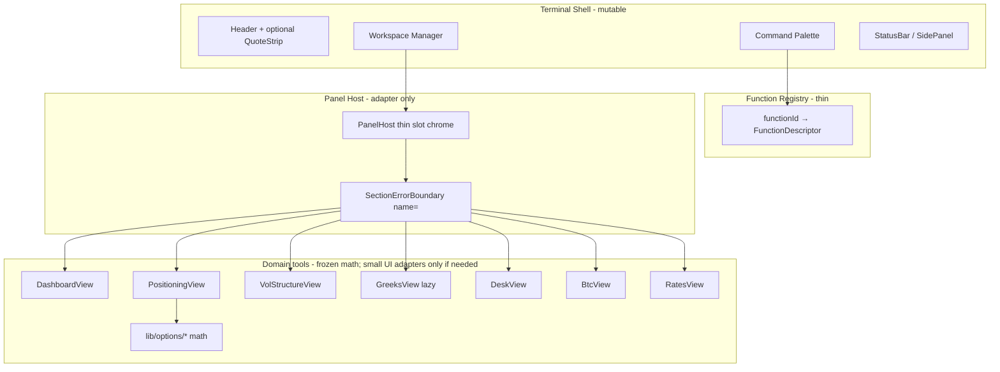
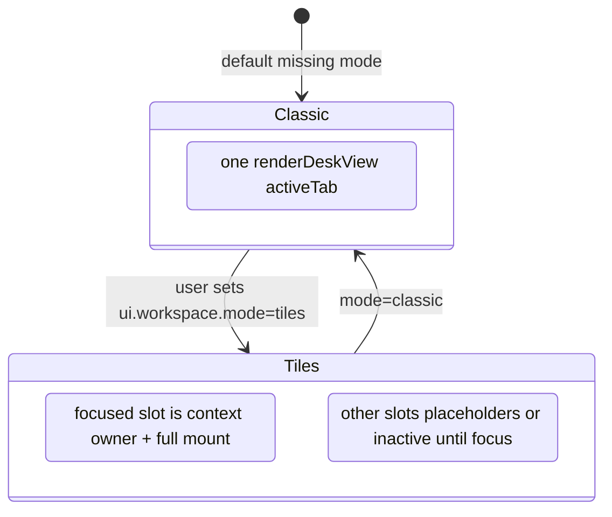
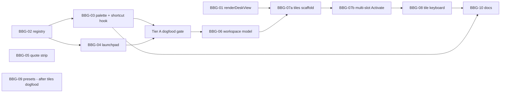

# VOLATERM — Bloomberg-Like Terminal Shell Redesign

| Field | Value |
|-------|--------|
| **Document** | UI Shell / Information Architecture / Interaction Model |
| **Author** | _TBD_ |
| **Date** | 2026-07-11 |
| **Status** | Accepted for implementation (Tier A first) — rev 4, user decisions 2026-07-11 |
| **Workspace** | `/home/kalde/trading-terminal-pro` |
| **Product** | VOLATERM — Options Trading Terminal |
| **Live** | https://volaterm-production-f082.up.railway.app |
| **Related** | `DESIGN.md` (as-built architecture), `UI_UX_PLAN.md` (Phases A–H shipped), `UPSCALE_PLAN.md`, `UPGRADE_PLAN.md` |

---

## Overview

VOLATERM already ships a dense, monochrome, keyboard-aware **7-desk options terminal** (React 19 + TypeScript + Vite + Zustand + Tailwind; Fastify `server.js`; MacroVol FastAPI). Phases A–H delivered density, trust chips, section jump (`[` `]`), board focus, LIVE-only product mode, and shared chrome (`Panel`, `DeskChrome`, `DeskModeBar`).

This design defines what **“Bloomberg-like” means for VOLATERM** — functional UX only (not a legal BBG clone or fake data feeds): function-code command palette, launchpad, persistent quote/watchlist strips, keyboard-first navigation, high-contrast terminal aesthetic, and an **opt-in workspace shell** for layout memory. Delivery strategy: **evolve the shell; treat domain tools as panels**; **classic single-desk remains the fail-open default**; never big-bang rewrite GEX/SVI/rates math.

**Tier B honesty (v1):** “Tiles” are **not** simultaneous dual live boards. They are a CSS-grid **workspace memory** (2–4 slot chrome with function codes) around **exactly one live desk mount** (focused/Activate). Faster co-location of *presets* and one-click switch—not vol + GEX + rates painted at once. Dual live mounts remain Open Q6 / post-dogfood.

---

## Background & Motivation

### Current as-built shell

```
┌─────────────────────────────────────────────────────────────┐
│ TerminalHeader  (symbol, MODE LIVE, freshness summary)      │  src/components/terminal/TerminalHeader.tsx
├─────────────────────────────────────────────────────────────┤
│ TabNav  (7 desks, hotkeys 1–7)                              │  tabs.ts + TabNav.tsx
├─────────────────────────────────────────────────────────────┤
│ DeskContextBar  (section label + API provenance)            │  DeskContextBar.tsx
├─────────────────────────────────────────────────────────────┤
│ main  → single active view via switch(activeTab)            │  TerminalLayout.tsx renderView()
├─────────────────────────────────────────────────────────────┤
│ SidePanel  (display mode, expiries, chain sources)          │  layout/SidePanel.tsx
│ PlaybackBar  (when historicalFrames ≥ 2)                    │
│ StatusBar                                                   │
└─────────────────────────────────────────────────────────────┘
```

| Concern | Implementation |
|---------|----------------|
| **Entry** | `src/App.tsx` → `TerminalLayout` |
| **Tab SoT** | `TabId` / `TABS` in `src/components/terminal/tabs.ts`; `ActiveTab` in `src/lib/options/types.ts` (keep in sync; registry uses **`ActiveTab`**) |
| **Views** | `DashboardView`, `VolStructureView`, `PositioningView`, `GreeksView` (lazy in layout), `DeskView`, `BtcView`, `RatesView` |
| **Section nav** | `src/config/deskNav.ts` + `jumpDeskSection` + `[` `]` in `useKeyboardShortcuts` |
| **Deep-link today** | `sessionStorage desk.jump` written from Home; **consumed only in `RatesView`** (scroll after mount). Vol/Pos/Greeks use sub-mode button ids + `jumpDeskSection` `.click()` |
| **State** | Monolithic Zustand `src/store/terminalStore.ts`. `setActiveTab` clears `deskSection*` and `boardFocus` |
| **Layout presets** | Section open/closed only — `src/lib/market/deskLayout.ts` + `DeskLayoutControls` |
| **Watchlist** | Home-only strip — `WatchlistStrip` records last-seen metrics on mount (side effect) |
| **News** | Home-only `NewsStrip` (Finnhub + MacroVol SEC context) |
| **Chrome** | `Panel`, `DeskChrome`, `DeskModeBar`, `CollapsibleSection`, density CSS in `index.css` |
| **Shortcuts** | `useKeyboardShortcuts` — bare keys only; **no** `metaKey`/`ctrlKey`/`altKey` guards today |
| **Error boundary** | `SectionErrorBoundary` prop is **`name`**, not `label` |

### Pain points (why “Bloomberg-like” now)

1. **Single-desk monologue + lost layout memory** — `renderView()` mounts exactly one desk. Pros want faster return to a *preset arrangement* of desks (vol / GEX / rates). **v1 tiles do not paint multiple live desks at once**; they keep slot presets + one-click Activate so switching is spatial and sticky, not a simultaneous multi-board view (see §2.2).
2. **No function codes / command bar** — TabNav + letter hotkeys only.
3. **Watchlist & news are Home orphans** — not persistent terminal chrome.
4. **Layout presets only toggle collapsibles** — no panel tiling.
5. **Domain tools are already good** — risk is regressing them; opportunity is wrapping.
6. **Karpathy constraints** — simplicity, surgical edits; prior `DESIGN.md` rejected Zustand slices, OMS, big math rewrites.

### What “Bloomberg-like” means for THIS app

| Bloomberg-inspired capability | VOLATERM interpretation | Explicitly out of scope |
|------------------------------|-------------------------|-------------------------|
| Dense multi-panel workspace | **v1:** 2–4 slot **workspace chrome** + **one live desk**; Activate switches focus (layout memory, not dual-live) | Simultaneous multi-live boards (post-dogfood / Open Q6); full 8-monitor BBG |
| Function codes | Short codes: `POS`, `GEX`, `SMILE`, `RATES`, `SOFR`, `BTC` → tab + exact `deskNav` section id | Licensed BBG mnemonics or lookalike branding |
| Command palette | `Ctrl/Cmd+K` → fuzzy search functions + symbols | Terminal emulator / scripting language; GO chord deferred |
| Launchpad | Home grid of functions + recent + favorites | Separate “app store” product |
| Quote / watchlist strip | Optional shell tape of **last-seen** ATM IV / GEX (not live multi-symbol BBO) | Real-time paid multi-asset BBO fan-out |
| News / status | Thin scrolling status (existing Finnhub/SEC + alerts) | Full news terminal |
| Keyboard-first | Harden shortcut hook + palette; keep mouse | Voice / touch redesign |
| Monochrome high-contrast | Deepen existing graphite tokens; denser type | Fake amber BBG skin fighting data colors |
| Customizable layouts | Named workspace presets after dogfood | Cloud-synced enterprise workspace (v1) |

**Principle:** Bloomberg-like is **chrome + IA + interaction**. Data honesty (LIVE/DELAYED/STALE, OI-inferred GEX) stays as today.

---

## Goals & Non-Goals

### Goals

1. Define a **shell vs panel** architecture so existing desks ship as panel content with a clear freeze boundary (and listed surgical exceptions).
2. Deliver **incremental UX value** (command palette → launchpad → optional split workspace) with classic fail-open and instant rollback via localStorage.
3. Preserve **7-desk IA** as the default classic mode (realistic zero-regression for daily users).
4. Make **function registry** the single map of openable functions (tabs + exact `deskNav` section ids).
5. Optional shell watchlist with **single metrics owner**.
6. Ship a concrete **PR DAG** each mergeable alone.
7. Document a **tiles compatibility contract** (primary/focused slot, **max one live mount** in v1) and honest Tier B value (workspace memory, not dual-live boards).

### Non-Goals

- Cloning Bloomberg UI/IP, colors, fonts, or function names.
- New market data vendors or OPRA (see `UPGRADE_PLAN.md` / `DataProvider`).
- Rewriting analytics: `lib/options/*`, MacroVol Python services.
- Replacing Zustand, Tailwind, Vite, or Fastify.
- OMS / order entry.
- Mobile-first or multi-window Electron (v1 is single-window CSS grid).
- Dual-symbol or dual-book panels (blocked on dual-book work in `DESIGN.md`).
- Per-panel `selectedExpiry` / displayMode scoping (global SidePanel remains).
- Unifying Rates mega-panel refactor (independent track).

---

## Proposed Design

### 1. Compatibility strategy (split contract)



#### 1.1 Two-tier compatibility contract

| Tier | What ships | Isolation claim | Realistic? |
|------|------------|-----------------|------------|
| **A — Classic + palette + launchpad** | Single `renderDeskView(activeTab)`; registry; palette; Home launchpad | No second view mount; no dual `setDeskContext`; shortcuts hardened but classic bindings preserved | **Yes — airtight if tests hold** |
| **B — Tiles** | Multi-slot CSS grid; opt-in `ui.workspace.mode = 'tiles'` | Residual risks (below); **max one context-writing live desk** | **Not airtight** — explicit mitigations required |

**Tier A regression contract (every PR through BBG-05):**

1. Classic: all 7 desks load; shortcuts 1–7 / R / S / L / D / `[` `]` / `?` / letter aliases unchanged in meaning.
2. Domain unit tests green.
3. LIVE-only product mode; no demo UI.
4. Freshness honest (MODE LIVE ≠ data age).
5. Shortcut hook ignores bare-key handling when modifiers held (except registered mod combos).

**Tier B residual risks (must appear in PR-BBG-07 acceptance):**

| Residual risk | Severity | Mitigation in v1 |
|---------------|----------|------------------|
| Dual `setDeskContext` / unmount clear races | High | **Only focused (primary) slot mounts a full desk that writes context**; other slots are inert placeholders or “Activate” until focused (see §2.2) |
| Global DOM section ids in `jumpDeskSection` | High | Jump scoped to focused slot root via `querySelector` within slot container (surgical change to `jumpDeskSection` or wrapper that passes root) |
| Global `selectedExpiry` / `displayMode` | Medium | Document: SidePanel applies to chain-bearing desks globally; acceptable |
| Double `WatchlistStrip` metrics | Medium | Single shell owner; Home presentational when strip on |
| Double Plotly / heavy desks | High | v1: only one mount total; heavy flag = caution on Activate only |
| Nested chrome density | Medium | Thin slot chrome; no outer `Panel` title bar around full desks |
| `loading` independent-tab list drift | Medium | Single constant `INDEPENDENT_TABS` next to `renderDeskView` |

**Shared `renderDeskView` alone does not make Tier B safe** — it only prevents switch divergence. Tier B safety comes from the primary-slot / lazy-activate model.

#### 1.2 Control plane (no dual flags)

| Mechanism | Role |
|-----------|------|
| **`ui.workspace.mode`** (`classic` \| `tiles`) | User-facing workspace mode. Missing/invalid → **classic**. **This is the only workspace control plane.** |
| **`ui.shell.quoteStrip`** | `0`/`1`; default **`0` (off)** until dogfood |
| **Env `VITE_*` shell kill switch** | **Not used in v1.** No existing feature-flag pattern in app; do not invent `VITE_SHELL_V2` unless a deploy-time emergency appears later. |
| **Optional later hard kill** | If needed: dynamic `import()` of `WorkspaceGrid` only when mode is tiles — reduces parse of tiles module; **does not** claim “zero code paths when off” for always-on palette. |

**Fail-open:** invalid/missing `ui.workspace.v1` or mode → classic single `renderDeskView(activeTab)`.

**Honest wording:** Classic default is the safety valve. Palette and launchpad may be always-on (low risk) once shortcut hook is hardened. Tiles are opt-in and may keep a static import of thin modules; do **not** claim “zero new code paths when off.”

#### 1.3 Strategies table (revised)

| Strategy | Mechanism | Effect |
|----------|-----------|--------|
| **Shell vs panels** | Redesign shell; views stay content | Domain PRs continue |
| **Preserve view exports** | No renames; `renderDeskView` imports existing components | Tests/history valid |
| **Classic default** | `ui.workspace.mode` localStorage only | Production unchanged until user opts in |
| **Thin adapters** | `SectionErrorBoundary name={…}`; optional `embedded` / `isContextOwner` props as **allowed surgical exceptions** (KD-BBG-03) | Context race + double chrome fixable without math rewrite |
| **No math rewrite** | Shell never imports GEX/SVI | Numerical safety |
| **Tab id stability** | Same seven `ActiveTab` values | Deep-links/tests stable |
| **Surgical CSS** | `.workspace-*` only | Localized visual risk |

---

### 2. Information architecture

#### 2.1 Function registry

**File:** `src/config/functionRegistry.ts`

**Canonical `functionId` form (KD-BBG-12):**

- Desk only: `${tab}` e.g. `rates`, `positioning`
- Desk + section: `${tab}:${sectionId}` where `sectionId` is **exactly** a `deskNav` id (e.g. `rates:sec-stir`, `vol:vol-sub-smile`, `positioning:pos-sub-dealer`)

Registry **projects** `TABS` + `sectionsForTab`; it does not invent parallel section graphs.

##### Exact code → functionId map (v1)

| Code | functionId | Notes |
|------|------------|-------|
| `HOME` | `home` | |
| `VOL` | `vol` | Default sub after mount |
| `SURF` | `vol:vol-sub-surface` | |
| `SMILE` | `vol:vol-sub-smile` | |
| `TERM` | `vol:vol-sub-term` | |
| `FIT` | `vol:vol-sub-quality` | Surface fit |
| `POS` | `positioning` | |
| `CHAIN` | `positioning:pos-sub-chain` | |
| `DEAL` / `GEX` | `positioning:pos-sub-dealer` | OI-inferred GEX lives here |
| `LVL` | `positioning:pos-sub-levels` | |
| `EDGE` | `positioning:pos-sub-edge` | |
| `STRAT` | `positioning:pos-sub-strategy` | |
| `GRK` | `greeks` | |
| `HEAT` | `greeks:greeks-sub-heatmap` | |
| `PROF` | `greeks:greeks-sub-profile` | |
| `SENS` | `greeks:greeks-sub-sensitivity` | |
| `EXP` | `greeks:greeks-sub-byexpiry` | |
| `3D` | `greeks:greeks-sub-surface3d` | **heavy** |
| `MM` | `desk` | |
| `BTC` | `crypto` + `setSymbol('BTC')` | |
| `ETH` | `crypto` + `setSymbol('ETH')` | |
| `RATES` | `rates` | |
| `MACRO` | `rates:sec-macro` | |
| `MMKT` | `rates:sec-mm-strip` | Money markets (SOFR prints live here) |
| `SOFR` | `rates:sec-stir` | STIR / SOFR futures path (id `sec-stir`, label STIR) |
| `BASIS` | `rates:sec-basis` | |
| `PLUMB` | `rates:sec-plumbing` | |
| `UST` | `rates:sec-ust-data` | |
| `CURVE` | `rates:sec-curves` | |
| `AUCT` | `rates:sec-auctions` | |
| `NYFED` | `rates:sec-nyfed` | |
| `FX` | `rates:sec-fx` | |
| `JGB` | `rates:sec-japan` | |
| `WL` | shell action: focus quote strip | Not a desk |
| `HELP` | shell: open ShortcutsOverlay | |

Palette also accepts bare tickers → `sanitizeSymbol` + `setSymbol` (not functionIds).

##### `openFunction` algorithm (required)

Today `desk.jump` only works for Rates. Palette must work for all sectioned desks. **All navigation entry points** (palette, launchpad, TabNav, number keys, Activate) must keep store + workspace layout coherent.

```
openFunction(functionId):
  1. Resolve descriptor { tab, sectionId?, heavy? }.
  2. Tiles branch (if loadWorkspace().mode === 'tiles'):
       a. focused = layout.focusedSlotId (or first slot if null)
       b. set that slot's functionId = resolved id (full functionId, including section)
       c. ensure focusedSlotId = that slot; saveWorkspace(layout)
       d. // live mount will re-render via focused slot's functionId → tab
  3. setActiveTab(tab)  // clears deskSection* + boardFocus (existing store behavior).
  4. If sectionId:
       sessionStorage.setItem('desk.jump', sectionId)
       // applyDeskJump after mount (see helper):
       //   - button ids (vol-sub-*, greeks-sub-*, pos-sub-*): element.click()
       //   - else scrollIntoView (rates sec-*)
  5. setDeskContext from findSectionMeta when available (after jump applies).
  6. Optional: setSymbol when descriptor requests (BTC/ETH).
```

**Mode-aware contract:** Classic ignores step 2. Tiles **must** update focused slot + persist before/with `setActiveTab`, or chrome/`ui.workspace.v1` desyncs from the live desk (e.g. palette opens `GEX` but slot still shows prior code). Number keys / TabNav (KD-BBG-14) are thin wrappers around the same step-2+3 path.

**Implementation note:** Extract `applyDeskJump(sectionId: string, root?: ParentNode): void` used by:

- `RatesView` (replace inline effect),
- `VolStructureView` / `PositioningView` / `GreeksView` (one-line mount effect each — **surgical**, allowed under KD-BBG-03),
- palette / launchpad after tab switch (rAF or short timeout like Rates’ 80ms for mount).

`openFunction` may take optional workspace callbacks for testability, or import `loadWorkspace`/`saveWorkspace` directly once BBG-06 exists. Until workspace module exists, step 2 is a no-op (classic-only Tier A).

**Do not** only call store setters without jump intent — that would only switch desks.

Unit tests: registry maps codes → functionIds; `openFunction` writes `desk.jump`; **when mode=tiles, focused slot `functionId` updates and is saved**. Integration-style: one section per desk family.

#### 2.2 Classic vs tiled workspace — primary / focused slot model



**Classic (default):** Identical to today’s single switch. TabNav remains primary chrome.

**Tier B v1 product value (honest framing):**

| What users get | What they do **not** get in v1 |
|----------------|--------------------------------|
| Named/spatial **workspace memory** (split/quad slot labels + function codes) | Two (or more) **live** desk boards painted simultaneously |
| One-click **Activate** / `Alt+1..4` to switch which desk is mounted | True visual co-location of vol *and* GEX *and* rates at once |
| Faster than pure TabNav when layouts are sticky | Multi-monitor / dual-live until Open Q6 |

Tiles v1 = **classic monologue + multi-slot chrome**, not a dual-board terminal.

**Tiles (opt-in) — explicit store contract:**

| Concept | Definition |
|---------|------------|
| **Focused slot** | Slot with keyboard/mouse focus; focus ring visible; **only full desk mount** |
| **Primary / context-owner** | Same as focused slot in v1. Owns: global `activeTab` sync, `setDeskContext` writers, `[` `]` section jump root, SidePanel semantic applicability |
| **Secondary slots** | Show **desk label + function code + Activate** only. **Never** mount full desk views in v1 |
| **Number keys `1`–`7` / TabNav / palette / launchpad** | All call **mode-aware `openFunction`** (or shared helper): tiles → update focused slot `functionId` + `saveWorkspace` → `setActiveTab` + jump |
| **`[` `]`** | Jump only within **focused slot’s DOM root** |
| **`Alt+1..4`** | Change focused slot (then mount that slot’s stored functionId); requires shortcut mod plumbing — §3 |

**v1: max concurrent live desk mounts = 1.** Dual live (even read-only `isContextOwner={false}`) is **out of scope** until Open Q6 dogfood.

**Layout templates (v1) — desk-level only:**

| Template | Grid | Example (desk functionIds) |
|----------|------|----------------------------|
| `single` | 1×1 | `positioning` |
| `split-h` | 1×2 50/50 fixed | `vol` \| `positioning` |
| `split-v` | 2×1 50/50 fixed | `rates` over `crypto` (**not** Chain over Levels — those are sub-modes inside one desk) |
| `quad` | 2×2 | `rates`, `vol`, `positioning`, `crypto` |

**Sub-mode in a slot:** allowed as `functionId` like `positioning:pos-sub-chain` — still mounts **whole** `PositioningView`, then `applyDeskJump` selects sub-mode. There is no separate Chain-only component route in v1.

**Resize:** fixed CSS grid fractions (50/50, 1fr 1fr). **No drag-resize in v1.**

**Per-slot symbol:** deferred (global store only).

Persist: `localStorage` `ui.workspace.v1`; fail-open classic.

#### 2.3 Shell regions

```
┌─ Quote / Watchlist strip (default OFF; last-seen metrics) ───────────┐
├─ Header (symbol, MODE LIVE, trust, ⌘K palette control) ──────────────┤
├─ TabNav (always visible; tiles: drives focused slot) ────────────────┤
├─ DeskContextBar (primary/focused slot section + APIs) ───────────────┤
├─ Workspace main ─────────────────────────────────────────────────────┤
│  focused: full desk via renderDeskView                               │
│  others: Activate placeholders                                       │
├─ SidePanel (global display/expiries) ────────────────────────────────┤
├─ PlaybackBar (app-level, if frames ≥ 2) / StatusBar ─────────────────┘
```

| Piece | Today | Target |
|-------|-------|--------|
| `WatchlistStrip` | Home; records metrics on mount | Shell optional strip = **sole metrics owner** when on; **Home strip hidden** when shell strip enabled (KD-BBG-10 / **KD-BBG-18**) |
| `NewsStrip` / `AlertsBar` | Home | Optional later; not required for tiles |
| `BootBriefing` | App-level overlay once | **Remains app-level once**; not per-tile |
| `PlaybackBar` | App-level when frames ≥ 2 | **Unchanged app-level** |
| `SymbolDialog` / palette | S / ⌘K | Share `sanitizeSymbol` path |
| Crypto dual-book | Tape in `BtcView` | Crypto tile = **same single active store symbol** as today; no dual-symbol tiles |

Copy for watchlist: **“Last-seen ATM IV / GEX”** — never “live quotes” multi-symbol streaming.

---

### 3. Interaction model

#### 3.1 Shortcut hook hardening (prerequisite for palette & tiles)

**File:** `src/hooks/useKeyboardShortcuts.ts`

Today: bare keys only; `1`–`9` always fire `tab${key}`; no meta/ctrl/alt check → **Cmd+K would also fire `k` (board focus)**; **Alt+1 would also fire `tab1`**.

**Required behavior:**

```
on keydown:
  if target is INPUT/TEXTAREA/SELECT: return (existing)
  if e.metaKey || e.ctrlKey || e.altKey:
    // only handle explicitly registered mod combos
    handleModCombo(e)  // e.g. mod+k → palette; alt+1..4 → focus slot
    preventDefault when handled
    return  // do NOT fall through to bare k / tab1
  // existing bare-key map...
```

Register optional map entries e.g. `mod+k`, `alt+1`…`alt+4`. Extend unit tests.

**Palette open chord (KD-BBG-11):** **`Ctrl/Cmd+K` only** in v1. No GO two-key sequence (avoids bare `g` conflicts). Revisit later if requested.

#### 3.2 Command palette

**Component:** `src/components/terminal/CommandPalette.tsx`

- Open: `mod+k` via hardened hook.
- Fuzzy match registry + watchlist symbols.
- Results render as **React text nodes only** (no `dangerouslySetInnerHTML` / raw HTML).
- Actions: `openFunction`, `setSymbol`, toggle density, toggle workspace mode, HELP.
- **a11y (PR-BBG-03 checklist):** `role="dialog"` `aria-modal="true"`; focus trap; restore focus on close; arrow keys move list; Enter selects; Escape closes.

**Escape stack (wired in `TerminalLayout`):**

1. Command palette open → close palette  
2. ShortcutsOverlay open → close  
3. ImplyDrawer (own listeners; do not break)  
4. Board focus → `clearBoardFocus`  
5. else no-op  

Today escape only handles ShortcutsOverlay → board focus; palette must be **first** in `TerminalLayout`’s escape handler.

#### 3.3 Keyboard summary

| Key | Classic | Tiles |
|-----|---------|-------|
| `1`–`7` | `setActiveTab` | Replace **focused** slot functionId + `setActiveTab` |
| `[` `]` | Section jump global DOM | Jump within focused slot root |
| `R` `S` `L` `D` | Unchanged | Unchanged |
| `?` | Shortcuts | Unchanged |
| `Ctrl/Cmd+K` | Palette | Palette |
| `Alt+1..4` | No-op (ignored by bare handler) | Focus slot N |
| `j` `k` / arrows | Board focus | Unchanged when board focused |

#### 3.4 Launchpad

Additive `LaunchpadGrid` on Home; calls same `openFunction`. Does not remove Home analytics cards.

---

### 4. Panel host & adapter pattern

```tsx
// Conceptual — thin slot chrome; NO outer Panel title bar around full desks
function PanelHost({
  functionId,
  isFocused,
  onActivate,
}: {
  functionId: string;
  isFocused: boolean;
  onActivate: () => void;
}) {
  const desc = resolveFunction(functionId);
  if (!isFocused) {
    return (
      <div className="workspace-slot workspace-slot-inactive" data-slot-root>
        <header className="workspace-slot-chrome font-mono text-type-2xs">
          {desc.code} · {desc.label}
        </header>
        <button type="button" onClick={onActivate}>Activate</button>
      </div>
    );
  }
  return (
    <SectionErrorBoundary name={desc.label}>
      <div className="workspace-slot workspace-slot-focused" data-slot-root data-desk-tab={desc.tab}>
        <header className="workspace-slot-chrome">{desc.code} · {desc.label}</header>
        {/* Jump intent already written by openFunction / Activate via desk.jump */}
        {renderDeskView(desc.tab)}
      </div>
    </SectionErrorBoundary>
  );
}
```

**Chrome rule:** Full desks already include `DeskChrome` / `DeskSubNav` / internal `Panel`s. Outer host uses **thin slot chrome** (code + focus ring) only — **not** a second `Panel` title bar. Optional later: `embedded` prop on Home-like views to hide nested watchlist when shell strip is on.

**Critical extraction — `renderDeskView`:**

Move from `TerminalLayout.tsx` into `src/components/layout/renderDeskView.tsx`:

1. **`INDEPENDENT_TABS`** constant (rates | greeks | home | crypto | desk) — single source for loading gate  
2. Loading skeleton when `loading && !independent`  
3. **`lazy()` for `GreeksView`** (owned here, not left in TerminalLayout only)  
4. `switch (tab)` + `Suspense`  

**Jump path (option B):** `renderDeskView(tab)` has **no** `pendingSectionId` option. Section targeting is solely `sessionStorage desk.jump` written by `openFunction` / Activate / keyboard **before** mount, then `applyDeskJump` inside each desk (or shared mount helper). PanelHost must not invent a second jump channel.

Classic and tiles both call `renderDeskView(tab)`.

#### 4.1 Heavy panels (v1 — single live mount)

Because **only the focused slot mounts a desk**, concurrent live count is always **0 or 1**. Do not implement dual-live heavy guards in v1.

| Focused functionId / tab | heavy? | v1 policy when focusing this slot |
|--------------------------|--------|-----------------------------------|
| `greeks` / `*:greeks-sub-surface3d` | **yes** | Mount allowed; optional confirm before Activate to 3D (dogfood); `perfMark desk.mount.greeks` |
| `vol` (lazy Surface inside view) | **yes** | Mount allowed; same single-mount rule |
| `rates` | medium | Mount allowed; no special concurrent limit (only one live) |
| `positioning`, `desk`, `home`, `crypto` | light | Mount allowed |

**Unfocused slots:** always placeholders — never mounted (no “frozen dual heavy” path).

**Post-dogfood (Open Q6):** if dual live is introduced, reintroduce concurrent heavy caps then—not now.

**Perf:** `PanelHost` calls `perfMark(\`desk.mount.${tab}\`)` on full mount; keep `desk.${activeTab}` on primary tab sync.

---

### 5. State changes (minimal)

| State | Where | Notes |
|-------|-------|-------|
| `workspaceMode` | `ui.workspace.mode` | classic \| tiles; fail-open classic |
| `workspaceLayout` | `ui.workspace.v1` | template + slots + focusedSlotId |
| `focusedSlotId` | React state (+ persist in layout JSON) | primary = focused |
| `shell.quoteStrip` | `ui.shell.quoteStrip` default **0** | off until dogfood |
| `function favorites` | localStorage optional | launchpad |
| Global store | unchanged for symbol/snapshot/expiry | tiles do not dual-scope |

---

### 6. Visual system

- Graphite tokens in `src/index.css`.
- `.workspace-slot-focused` focus ring; thin mono chrome.
- Do not recolor semantic `up`/`down`/`warn`/`rate`.

---

### 7. Accessibility & app-level chrome (tiles)

| Topic | Decision |
|-------|----------|
| Palette a11y | dialog + focus trap + aria-modal (PR-BBG-03) |
| Grid resize | Fixed fractions; no drag |
| BootBriefing | Once per app session; not per tile |
| PlaybackBar | App-level when `historicalFrames.length ≥ 2` |
| Crypto tile | Single active symbol; dual tape stays inside `BtcView` as today |

---

## API / Interface Changes

### Frontend only (v1)

No Fastify or MacroVol API changes.

### TypeScript surfaces

```ts
// src/config/functionRegistry.ts
import type { ActiveTab } from '../lib/options/types';

export type FunctionId = string; // `${ActiveTab}` | `${ActiveTab}:${sectionId}`

export type FunctionDescriptor = {
  id: FunctionId;
  code: string;
  label: string;
  tab: ActiveTab;
  sectionId?: string; // exact deskNav id
  apis?: string[];
  keywords?: string[];
  heavy?: boolean;
};

export function resolveFunction(id: FunctionId): FunctionDescriptor;
export function searchFunctions(query: string): FunctionDescriptor[];
/** Mode-aware: classic = tab+jump; tiles = also update focused slot + saveWorkspace */
export function openFunction(id: FunctionId): void;
// Uses store + sessionStorage desk.jump; no raw HTML.
// Until workspace module exists, tiles branch is no-op.
```

```ts
// src/lib/market/deskJump.ts (new small helper)
export function applyDeskJump(sectionId: string, root?: ParentNode): void;
// click sub-mode buttons or scroll section within root ?? document
```

```ts
// src/lib/market/workspaceLayout.ts
export type WorkspaceTemplate = 'single' | 'split-h' | 'split-v' | 'quad';
export type WorkspaceState = {
  version: 1;
  mode: 'classic' | 'tiles';
  template: WorkspaceTemplate;
  slots: { id: string; functionId: FunctionId }[];
  focusedSlotId: string | null;
};
export function loadWorkspace(): WorkspaceState;
export function saveWorkspace(s: WorkspaceState): void;
```

```ts
// src/components/layout/renderDeskView.tsx
export const INDEPENDENT_TABS: ReadonlySet<ActiveTab>;
/** Pure mount helper — no pendingSectionId; jump via desk.jump + applyDeskJump only */
export function renderDeskView(tab: ActiveTab): ReactNode;
// owns lazy Greeks + loading gate
```

```ts
// useKeyboardShortcuts — extended
// Ignore bare keys when meta/ctrl/alt; support mod+k, alt+1..4
```

---

## Data Model Changes

| Layer | Change |
|-------|--------|
| Server / DB | None |
| Zustand snapshot/surface | None for Tier A; tiles only sync `activeTab` from focused slot |
| localStorage | `ui.workspace.mode`, `ui.workspace.v1`, `ui.shell.quoteStrip` (default 0), optional favorites |
| sessionStorage | `desk.jump` generalized beyond Rates |

---

## Alternatives Considered

### A. Big-bang rewrite

**Reject** — regression risk, blocks domain PRs.

### B. Multi-window pop-outs

**Defer** — needs BroadcastChannel + dual fetch.

### C. Palette + launchpad only (no tiles)

**Accept as Tier A / first ship** — validates registry; zero multi-mount risk.

### D. Docking library day one

**Defer** — CSS grid templates first.

### E. Section-subset embeds (mount only Chain board without full PositioningView)

**Defer for v1.** Would require extracting boards from mega-views (violates freeze). v1 uses whole-desk mounts + `applyDeskJump` for sub-modes. Revisit if dual live panels become a hard requirement.

### F. Dual live mounts with store-scoped desk context slices

**Defer.** Correct long-term but large Zustand change; primary-slot model is simpler until proven insufficient.

---

## Security & Privacy Considerations

| Topic | Notes |
|-------|-------|
| **XSS** | Palette filters client-side; **results are React text only** (no HTML injection). Symbols via `sanitizeSymbol`. Never `eval`. |
| **localStorage** | UI chrome only; cap slots ≤4, favorites ≤12 (mirror `deskLayout` presets cap). |
| **API keys** | Unchanged. |
| **Auth** | No new surface. |
| **IP / branding** | Product copy: “VOLATERM workspace”, “function codes”, “command palette” — not Bloomberg/BBG. |
| **Data honesty** | GEX OI-inferred; watchlist is last-seen not live multi-BBO. |

---

## Observability

| Signal | How |
|--------|-----|
| Primary desk | Existing `perfMark(\`desk.${activeTab}\`)` |
| Panel mount | `perfMark(\`desk.mount.${tab}\`)` in PanelHost |
| Palette / openFunction | `perfMark('shell.palette')`; optional `console.debug` / mark with function **code** for support |
| Workspace mode | Dev log once if tiles |
| Errors | `SectionErrorBoundary` per focused slot |
| Regression | Vitest registry, deskJump, workspace load/save, shortcut mod guards; classic smoke checklist in BBG-01/07 |

---

## Rollout Plan

**Sequencing (KD-BBG-19):** Tier A ships and **dogfoods in production** before any Tier B tiles PRs merge. Do not start BBG-06/07a/07b/08 until palette + launchpad have lived for a dogfood window.

Single DAG (PR-BBG ids only):



1. Ship **Nav power** (02→03→04) — Tier A; optional BBG-01 early if convenient for cleanup.  
2. Quote strip (05) may ship with Tier A or just after; default off; when on, **hide Home strip** (KD-BBG-18).  
3. **Dogfood gate** — palette + launchpad live in production; collect feedback.  
4. **Only then** tiles: 06 → 07a → 07b → 08 (single-live workspace memory).  
5. Presets (09) after tiles dogfood — not on critical path.  
6. Rollback: set mode classic; revert shell PRs without touching `lib/options/*`.  
7. Railway: frontend-only Vite build.

### Risks

| Risk | Severity | Mitigation |
|------|----------|------------|
| Dual context-writing mounts | High | One focused full mount only |
| Shortcut mod collisions | High | Hook hardening in BBG-03 |
| Heavy double Plotly | High | Unmount non-focused heavy; max one 3D |
| Nested double chrome | Medium | Thin slot chrome only |
| Global expiry/display | Medium | Documented; acceptable v1 |
| Classic regression when tiles code present | High | Mode branch; smoke checklist; tiles default off |
| Scope creep data feeds | High | Non-goal |
| Docs drift | Low | BBG-10 |

---

## Key Decisions

| ID | Decision | Rationale |
|----|----------|-----------|
| **KD-BBG-01** | Bloomberg-like = shell/IA/interaction only; no feed or IP cosplay | Legal + honesty |
| **KD-BBG-02** | Classic single-desk default; missing/invalid mode → classic | Real production safety valve |
| **KD-BBG-03** | Views frozen for **math and structure**; allowed surgical UI hooks: `applyDeskJump` mount effects, optional `embedded` / `isContextOwner` | Freeze without blocking correct jump/context behavior |
| **KD-BBG-04** | Registry projects `tabs` + `deskNav` only | No second nav graph |
| **KD-BBG-05** | v1 global symbol/snapshot; **tiles = exactly one live desk mount** (focused); secondary = chrome only; dual live unsupported | Store is single-activeTab; avoids setDeskContext races |
| **KD-BBG-06** | Workspace state in localStorage, not Zustand (v1) | Matches deskLayout/density |
| **KD-BBG-07** | CSS grid fixed fractions before docking library | Min code |
| **KD-BBG-08** | Command palette (Tier A) before tiles (Tier B) | Early value, lower risk |
| **KD-BBG-09** | Heavy flags mark costly **focused** mounts only; **max concurrent live desks = 1** in v1 | Concurrent multi-live caps only after Open Q6 |
| **KD-BBG-10** | Shell watchlist = sole metrics owner when enabled; default **off** | Avoid double record effects; **KD-BBG-18** = hide Home strip when shell on |
| **KD-BBG-11** | Palette chord = **Ctrl/Cmd+K only** (no GO v1) | Implementable after mod-safe hook; no bare-g chord |
| **KD-BBG-12** | `functionId` = `${tab}` \| `${tab}:${sectionId}` with **exact deskNav ids** | Matches DOM and jump |
| **KD-BBG-13** | Workspace control plane = **localStorage only** (no VITE shell flag v1) | No existing flag pattern; classic is enough |
| **KD-BBG-14** | Tiles: keys `1`–`7`, TabNav, **palette, launchpad** all go through mode-aware path: focused slot `functionId` + `saveWorkspace` + `setActiveTab` | Chrome, layout persistence, live mount stay coherent |
| **KD-BBG-15** | v1 slots are **desk-level** mounts (+ optional sub-mode jump); not free-floating section widgets | Honest vs freeze; split-v examples are desk pairs |
| **KD-BBG-16** | TabNav remains visible in tiles | Users retain IA; drives focused slot |
| **KD-BBG-17** | Tier B v1 value = **workspace memory + Activate**, not simultaneous multi-live boards | Prevents stakeholder over-expectation; dual-live is Open Q6 |
| **KD-BBG-18** | When shell quote/watchlist strip is **on**, **hide Home `WatchlistStrip` automatically** (single metrics owner; no double `recordWatchMetrics`) | User decision 2026-07-11; solidifies KD-BBG-10 |
| **KD-BBG-19** | **Ship order:** complete Tier A (BBG-02→03→04, optional 01/05) → **dogfood in production** → only then Tier B tiles (BBG-06→07a→07b→08) | User decision 2026-07-11; palette/launchpad live before workspace chrome |

---

## Open Questions

1. ~~Palette chord~~ → **Closed KD-BBG-11** (Cmd/Ctrl+K only).  
2. ~~Tile number-key semantics~~ → **Closed KD-BBG-14**.  
3. ~~Home strip when shell strip on~~ → **Closed KD-BBG-18** (hide Home strip automatically; single metrics owner). User decision 2026-07-11.  
4. **Pop-out windows v1?** No.  
5. **URL-hash shareable layouts?** Nice-to-have; not required.  
6. **When to allow a second live desk** (e.g. read-only `isContextOwner={false}`)? Only after **Tier B** dogfood shows one-live + workspace memory is insufficient. Until then product copy must not imply dual-live.  
7. ~~Tiles sequencing vs Tier A~~ → **Closed KD-BBG-19** (Tier A first, dogfood, then tiles). User decision 2026-07-11.

---

## References

- As-built: `/home/kalde/trading-terminal-pro/DESIGN.md`
- UI phases: `/home/kalde/trading-terminal-pro/UI_UX_PLAN.md`
- Shell: `src/components/layout/TerminalLayout.tsx`, `SidePanel.tsx`
- Tabs: `src/components/terminal/tabs.ts`; types: `src/lib/options/types.ts` (`ActiveTab`)
- Section nav: `src/config/deskNav.ts`
- Store: `src/store/terminalStore.ts` (`setActiveTab` clears context/focus)
- Shortcuts: `src/hooks/useKeyboardShortcuts.ts`
- Jump consumer: `src/components/views/RatesView.tsx` (`desk.jump`)
- Context writers: `VolStructureView`, `PositioningView`, `GreeksView`, `DeskSubNav`
- Error boundary: `src/components/common/SectionErrorBoundary.tsx` (`name`)
- Watchlist: `src/components/common/WatchlistStrip.tsx`, `src/lib/market/watchlist.ts`
- Layout presets: `src/lib/market/deskLayout.ts`

---

## PR Plan

Ordered, independently reviewable. Each keeps classic mode green.

### PR-BBG-01 — Extract shared desk renderer

| Field | Content |
|-------|---------|
| **Title** | `shell: extract renderDeskView helper from TerminalLayout` |
| **Files** | `TerminalLayout.tsx`, **new** `renderDeskView.tsx` (+ test optional) |
| **Depends on** | None |
| **Description** | Move **loading gate + `INDEPENDENT_TABS` + lazy `GreeksView` + switch + Suspense** into shared helper. Classic layout is sole caller initially (tiles call later). **Acceptance:** behavior-identical classic; independent tabs still skip chain skeleton; Greeks still code-split. **Smoke checklist:** 7 desks, LIVE SPY, Rates without chain, Crypto path. |

### PR-BBG-02 — Function registry + desk jump helper

| Field | Content |
|-------|---------|
| **Title** | `config: functionRegistry + applyDeskJump` |
| **Files** | **new** `functionRegistry.ts`, `functionRegistry.test.ts`, **new** `lib/market/deskJump.ts` (+ test); optional RatesView/Vol/Pos/Greeks one-line effects for shared jump |
| **Depends on** | None (parallel to 01) |
| **Description** | Exact code→functionId table; `searchFunctions`; `openFunction` = (tiles: update focused slot + save) + setActiveTab + `desk.jump` + apply protocol. Tiles branch no-op until BBG-06; unit-test maps + jump intent; tiles slot-update test when workspace API present (or mock). Generalize jump beyond Rates. |

### PR-BBG-03 — Shortcut hardening + command palette

| Field | Content |
|-------|---------|
| **Title** | `shell: mod-safe shortcuts + Ctrl/Cmd+K command palette` |
| **Files** | `useKeyboardShortcuts.ts` (+ tests), **new** `CommandPalette.tsx` (+ tests), `TerminalLayout.tsx` (escape stack), `ShortcutsOverlay.tsx` |
| **Depends on** | PR-BBG-02 |
| **Description** | **Hook:** ignore bare keys when meta/ctrl/alt; register `mod+k`. Palette: text-only results, a11y dialog, `openFunction`, sanitize symbols. Escape: palette → shortcuts → board focus. **This PR unblocks** safe chords; required before Alt+slot in BBG-08. |

### PR-BBG-04 — Launchpad grid on Home

| Field | Content |
|-------|---------|
| **Title** | `home: registry-driven launchpad grid` |
| **Files** | **new** `LaunchpadGrid.tsx`, `DashboardView.tsx` (additive) |
| **Depends on** | PR-BBG-02 (palette optional) |
| **Description** | Function buttons calling `openFunction`. Keep existing Home cards. |

### PR-BBG-05 — Shell quote / watchlist strip

| Field | Content |
|-------|---------|
| **Title** | `shell: optional watchlist strip (default off, single metrics owner)` |
| **Files** | Split presentational vs metrics owner in/near `WatchlistStrip.tsx`; `TerminalLayout.tsx`; `ui.shell.quoteStrip` default **0** |
| **Depends on** | None |
| **Description** | Default **off**. When on: shell owns `recordWatchMetrics` / auto-add; **Home `WatchlistStrip` not rendered** (KD-BBG-18). Copy: last-seen, not live multi-BBO. |

### PR-BBG-06 — Workspace layout model

| Field | Content |
|-------|---------|
| **Title** | `workspace: localStorage layout model + load/save` |
| **Files** | **new** `workspaceLayout.ts` (+ test) |
| **Depends on** | PR-BBG-02 (FunctionId); **Tier A dogfood recommended before merge to main if paired with tiles work (KD-BBG-19)** |
| **Description** | Templates single/split-h/v/quad; validation; fail-open classic. No visual change. Pure module may land anytime; **do not enable tiles UI until after Tier A dogfood.** |

### PR-BBG-07a — Tiles scaffold (single live slot)

| Field | Content |
|-------|---------|
| **Title** | `shell: tiles mode scaffold with single live focused slot` |
| **Files** | **new** `WorkspaceGrid.tsx`, `PanelHost.tsx` (thin chrome); `TerminalLayout.tsx` mode branch; `.workspace-*` CSS |
| **Depends on** | PR-BBG-01, PR-BBG-06, PR-BBG-02; BBG-03 shipped; **Tier A dogfood gate passed (KD-BBG-19)** |
| **Description** | **Do not start until Tier A dogfood.** mode=tiles: **exactly one** full `renderDeskView` for focused slot; other cells Activate placeholders (workspace memory UX, not dual-live). Wire `openFunction` tiles branch to slot updates. Sync `activeTab` from focused functionId. **Classic path untouched when mode=classic.** Smoke: classic parity with tiles code present but disabled. Product copy: no claim of simultaneous multi-board. |

### PR-BBG-07b — Multi-slot activate + heavy limits

| Field | Content |
|-------|---------|
| **Title** | `shell: multi-slot activate + heavy unmount policy` |
| **Files** | `WorkspaceGrid.tsx`, `PanelHost.tsx`, registry `heavy` flags |
| **Depends on** | PR-BBG-07a |
| **Description** | Click Activate to move focus/full mount; previous slot unmounts. Enforce max one heavy 3D. `perfMark desk.mount.*`. |

### PR-BBG-08 — Tile keyboard

| Field | Content |
|-------|---------|
| **Title** | `shell: Alt+1..4 slot focus; 1–7 replace focused function` |
| **Files** | `useKeyboardShortcuts` alt combos, `WorkspaceGrid`, `TerminalLayout`, ShortcutsOverlay |
| **Depends on** | PR-BBG-07b, PR-BBG-03 |
| **Description** | Implement KD-BBG-14. Section jump scoped to focused `[data-slot-root]`. |

### PR-BBG-09 — Workspace presets UI (deferred)

| Field | Content |
|-------|---------|
| **Title** | `shell: named workspace presets` |
| **Files** | `WorkspaceLayoutControls.tsx` or extend desk layout controls; `workspaceLayout.ts` |
| **Depends on** | PR-BBG-07b dogfood |
| **Description** | **Optional after dogfood** — not required for tiles MVP. Cap presets. |

### PR-BBG-10 — Docs + polish

| Field | Content |
|-------|---------|
| **Title** | `docs: workspace shell, palette, tier A/B contract` |
| **Files** | README, ShortcutsOverlay parity, DESIGN/UI_UX cross-link |
| **Depends on** | PR-BBG-03 minimum; 07b when tiles ship |
| **Description** | Classic vs tiles, function codes, honesty, rollback, last-seen watchlist. |

---

### Suggested merge batches

| Batch | PRs | User-visible value | Gate |
|-------|-----|--------------------|------|
| **Nav power (Tier A)** | 02 → 03 → 04 (+ optional 01) | Palette + launchpad; no multi-mount | Ship first |
| **Persistent tape** | 05 | Optional last-seen strip; hide Home when on | With or right after Tier A |
| **Dogfood** | — | Production use of palette/launchpad | **Required before Tier B (KD-BBG-19)** |
| **Workspace memory (Tier B)** | 06 → 07a → 07b → 08 (01 if not earlier) | Single-live multi-slot chrome | After dogfood only |
| **Deferred** | 09 | Named presets | After tiles dogfood |
| **Hardening** | 10 | Docs | After Tier A min; update again after B |

---

### User decisions (2026-07-11)

Open question **3** (Home strip when shell strip on) and **sequencing for tiles** are **resolved by product owner 2026-07-11**:

1. **Hide Home watchlist strip automatically** when the shell quote/watchlist strip is enabled (single metrics owner; KD-BBG-18).  
2. **Tier A first → dogfood → then Tier B tiles** under single-live workspace memory (KD-BBG-19). Palette and launchpad live for a production dogfood window before BBG-07a/07b.

---

*End of design document (rev 4).*
